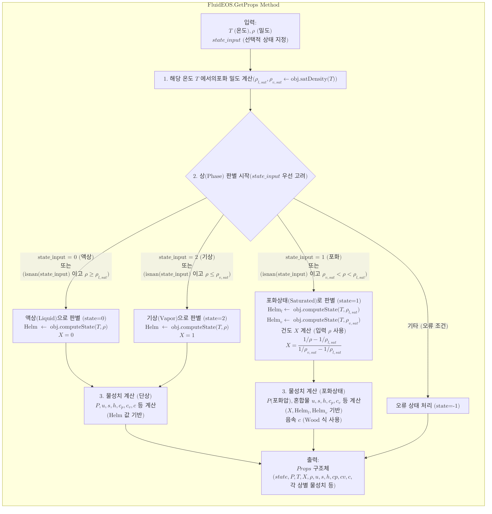
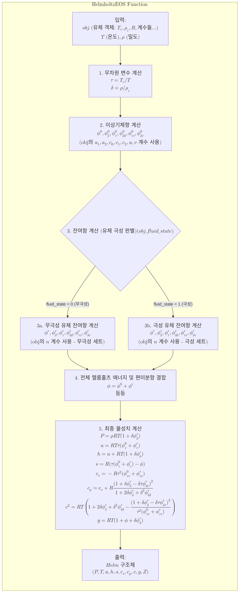
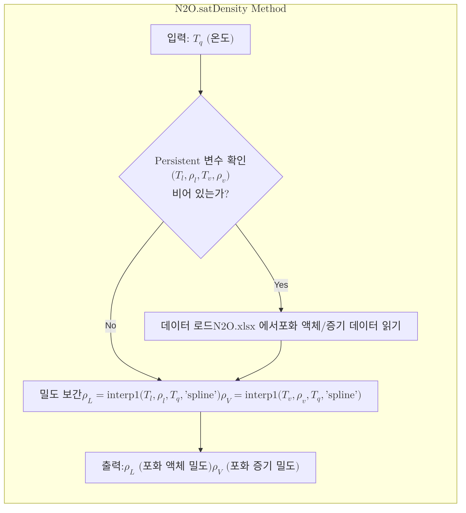

---
tags:
  - 흐름도
---
# 주요 해석 구조
- 전체적으로 Input-System-Ouput 구조이다.
	- Input에는 하이브리드 모터 제원의 사이즈에 대한 입력값의 전처리
	- System에는 PreFeed-LiqFeed-VapFeed 순서의 해석
	- Output에는 해석에 대한 결과를 후처리하여 시간에 대해 플롯 해준다.

## Mermaid 플로우차트

```mermaid
graph TD
    Start["해석 시작"] --> InputStage;

    subgraph SG1["1\\. 입력 조건 정의 (Input)"]
        direction TB
        InputStage("초기 시스템 물성치 및<br>해석 조건 설정");
    end

    InputStage --> PreFeedStage_Entry;

    subgraph SG2["2\\. 연소 전 준비 단계 (PreFeed)"]
        direction TB
        PreFeedStage_Entry["PreFeed 시작"];
        PreFeedStage_Entry --> PF_TankVenting["탱크 증기 벤팅량 계산"];
        PF_TankVenting --> PF_TankUpdate["시간에 따른 탱크<br>물리량 업데이트"];
        PF_TankUpdate --> PreFeedStage_Exit["PreFeed 종료"];
    end

    PreFeedStage_Exit --> LiqFeedDecision;

    LiqFeedDecision{"산화제 공급 형태 결정<br>(액상/기상)"};
    LiqFeedDecision -- 액상 공급(탱크 내부가 포화 또는 과냉) --> LiqFeedStage_Entry;
    LiqFeedDecision -- 기상 공급(탱크 내부가 과열) --> VapFeedStage_Entry;
    
    subgraph SG3["3\\. 액상 산화제 공급 및 연소 단계 (LiqFeed)"]
        direction TB
        LiqFeedStage_Entry["LiqFeed 시작"];
        LiqFeedStage_Entry --> LF_OxTank["산화제 탱크<br>액상 유출 해석"];
        LF_OxTank --> LF_Injector["인젝터<br> 2상(또는 액상) 유동 해석"];
        LF_Injector --> LF_FuelRegression["고체 연료<br>후퇴율 계산"];
        LF_FuelRegression --> LF_Combustion["연소실<br>화학 평형 해석(CEA)"];
        LF_Combustion --> LF_Nozzle["노즐<br>추력 발생 계산"];
        LF_Nozzle --> LF_UpdateStates["시스템 전체<br>물리량 업데이트"];
        LF_UpdateStates --> LiqFeedStage_Exit["LiqFeed 종료"];
    end

    LiqFeedStage_Exit --> CheckLiqDepletion;
    CheckLiqDepletion{"탱크 내부 액상 산화제 고갈 여부 확인"};
    CheckLiqDepletion -- 고갈 감지 --> ExtrapolateStage;
    CheckLiqDepletion -- 액상 유지 --> SimulationEndDecision;
    
    ExtrapolateStage["액상 고갈 시점<br>물리량 외삽"];
    ExtrapolateStage --> VapFeedStage_Entry;

    subgraph SG4["4\\. 기상 산화제 공급 및 연소 단계 (VapFeed)"]
        direction TB
        VapFeedStage_Entry["VapFeed 시작"];
        VapFeedStage_Entry --> VF_OxTank["산화제 탱크<br>기상 유출 해석"];
        VF_OxTank --> VF_Injector["인젝터<br>기상 유동 해석"];
        VF_Injector --> VF_FuelRegression["고체 연료<br>후퇴율 계산"];
        VF_FuelRegression --> VF_Combustion["연소실<br>화학 평형 해석(CEA)"];
        VF_Combustion --> VF_Nozzle["노즐<br>추력 발생 계산"];
        VF_Nozzle --> VF_UpdateStates["시스템 전체<br>물리량 업데이트"];
        VF_UpdateStates --> VapFeedStage_Exit["VapFeed 종료"];
    end
    
    VapFeedStage_Exit --> SimulationEndDecision;

    SimulationEndDecision{"해석 종료 조건 판단<br>(최대 시간, 최소 압력 등)"};
    SimulationEndDecision -- 해석 지속 --> LiqFeedDecision;
    SimulationEndDecision -- 해석 종료 --> OutputStage_Entry;

    subgraph SG5["5\\. 결과 분석 및 출력 (Output)"]
        direction TB
        OutputStage_Entry["Output 시작"];
        OutputStage_Entry --> OutputStage("시간에 따른<br>주요 성능 지표<br>분석 및 시각화");
        OutputStage --> OutputStage_Exit["Output 종료"];
    end

    OutputStage_Exit --> End["해석 종료"];

    classDef main fill:#f9f,stroke:#333,stroke-width:2px;
    classDef process fill:#9cf,stroke:#333,stroke-width:2px;
    classDef decision fill:#ccf,stroke:#333,stroke-width:2px;
    classDef io fill:#lightgrey,stroke:#333,stroke-width:2px;

    class Start,End io;
    class InputStage,PreFeedStage_Entry,PreFeedStage_Exit,LiqFeedStage_Entry,LiqFeedStage_Exit,VapFeedStage_Entry,VapFeedStage_Exit,OutputStage_Entry,OutputStage,OutputStage_Exit,ExtrapolateStage process;
    class PF_TankVenting,PF_TankUpdate process;
    class LF_OxTank,LF_Injector,LF_FuelRegression,LF_Combustion,LF_Nozzle,LF_UpdateStates process;
    class VF_OxTank,VF_Injector,VF_FuelRegression,VF_Combustion,VF_Nozzle,VF_UpdateStates process;
    class LiqFeedDecision,CheckLiqDepletion,SimulationEndDecision decision;
```



### 플로우차트 설명

1.  **입력 조건 정의 (Input)**: 시뮬레이션에 필요한 하이브리드 로켓 모터의 형상, 연료/산화제의 초기 물성치, 연소 시간, 주변 환경 조건 등 초기 해석 조건을 설정합니다.

2.  **연소 전 준비 단계 (PreFeed)**: 실제 연소가 시작되기 전, 산화제 탱크 내부의 물리적 변화를 모사합니다. 이 단계는 탱크에서 증기 상태의 산화제가 벤트되는 과정을 포함합니다.
    *   **탱크 증기 벤팅량 계산**: 설정된 벤트 조건을 바탕으로 탱크에서 빠져나가는 증기 상태 산화제의 양을 계산합니다.

        ```mermaid
        graph TD
            subgraph SG_Vent_ICF["$$\\text{탱크 증기 벤팅량 계산 (Vent\\_ICF)}$$"]
                direction TB
                VENT_Input["$$ \\begin{gathered} \\text{입력:} \\\\ P_{tank}, P_{amb}, \\rho_v, c_{p,v}, c_{v,v} \\\\ A_{vent}, C_{d,vent} \\end{gathered} $$"]
                VENT_Gamma["$$ \\gamma = c_{p,v} / c_{v,v} $$"]
                VENT_Ratios["$$ \\begin{gathered} \\text{압력비 계산} \\\\ \\text{ratio}_{Pcr} = \\left( \\frac{2}{\\gamma + 1} \\right)^{\\frac{\\gamma}{\\gamma - 1}} \\\\ \\text{ratio}_{P} = P_{amb} / P_{tank} \\end{gathered} $$"]
                VENT_FlowDecision{"$$ \\text{ratio}_P \\le \\text{ratio}_{Pcr} ? $$"}
                VENT_ChokedMdot["$$ \\begin{gathered} \\text{초크 유량 계산} \\\\ \\dot{m}_{vent} = C_{d,vent}A_{vent} \\sqrt{ \\gamma \\rho_v P_{tank} \\left( \\frac{2}{\\gamma + 1} \\right)^{\\frac{\\gamma + 1}{\\gamma - 1}} } \\end{gathered} $$"]
                VENT_NonChokedMdot["$$ \\begin{gathered} \\text{비초크 유량 계산} \\\\ \\dot{m}_{vent} = C_{d,vent}A_{vent} \\sqrt{ \\frac{2\\gamma}{\\gamma-1} \\rho_v P_{tank} \\left[ \\left(\\frac{P_{amb}}{P_{tank}}\\right)^{\\frac{2}{\\gamma}} - \\left(\\frac{P_{amb}}{P_{tank}}\\right)^{\\frac{\\gamma+1}{\\gamma}} \\right] } \\end{gathered} $$"]
                VENT_Output["$$ \\begin{gathered} \\text{출력:} \\\\ \\dot{m}_{vent}, \\text{ratio}_{Pcr}, \\text{ratio}_P \\end{gathered} $$"]

                VENT_Input --> VENT_Gamma;
                VENT_Gamma --> VENT_Ratios;
                VENT_Ratios --> VENT_FlowDecision;
                VENT_FlowDecision -- Yes (Choked) --> VENT_ChokedMdot;
                VENT_FlowDecision -- No (Non-choked) --> VENT_NonChokedMdot;
                VENT_ChokedMdot --> VENT_Output;
                VENT_NonChokedMdot --> VENT_Output;
            end

    *   **시간에 따른 탱크 물리량 업데이트**: 벤팅에 따른 탱크 내부 압력, 온도, 남은 산화제 양 등의 변화를 시간 단계별로 계산합니다.

        ```mermaid
        graph TD
            subgraph SG_Tank_PreFeed["$$\\text{Tank\\_PreFeed: 탱크 상태 업데이트}$$"]
                direction TB
                TPF_Input["$$ \\begin{gathered} \\text{입력 파라미터:} \\\\ m_{tank}, \\dot{m}_{vent}, V_{tank}, h_v, H_{tank}, \\Delta t \\\\ \\text{설명:} \\\\ \\text{초기 탱크 질량, 벤트 유량, 탱크 부피,} \\\\ \\text{증기 비엔탈피, 총 엔탈피, 시간 간격} \\end{gathered} $$"]
                TPF_Mass["$$ \\begin{gathered} \\text{1. 질량 및 밀도 갱신} \\\\ m_{tank,new} = m_{tank} - \\dot{m}_{vent} \\Delta t \\\\ \\rho_{tank,new} = m_{tank,new} / V_{tank} \\end{gathered} $$"]
                TPF_Enthalpy["$$ \\begin{gathered} \\text{2. 엔탈피 갱신} \\\\ \\dot{H}_{vent} = \\dot{m}_{vent} h_v \\\\ H_{tank,new} = H_{tank} - \\dot{H}_{vent} \\Delta t \\\\ h_{tank,new} = H_{tank,new} / m_{tank,new} \\end{gathered} $$"]
                TPF_Solver["$$ \\begin{gathered} \\text{3. 엔탈피 알고리즘 (온도 예측)} \\\\ T_{tank,new} = \\text{lsqnonlin} \\left( T \\rightarrow h(T, \\rho_{tank,new}) - h_{tank,new} \\right) \\end{gathered} $$"]
                TPF_Props["$$ \\begin{gathered} \\text{4. 최종 상태량 계산} \\\\ \\mathbf{X}_{tank,new} = \\text{GetProps}(T_{tank,new}, \\rho_{tank,new}) \\end{gathered} $$"]
                TPF_Output["$$ \\begin{gathered} \\text{출력:} \\\\ \\text{갱신된 탱크 상태량} \\\\ (P, T, X, m, \\rho, h, s, \\text{등}) \\end{gathered} $$"]

                TPF_Input --> TPF_Mass;
                TPF_Mass --> TPF_Enthalpy;
                TPF_Enthalpy --> TPF_Solver;
                TPF_Solver --> TPF_Props;
                TPF_Props --> TPF_Output;
            end
        ```

3.  **액상 산화제 공급 및 연소 단계 (LiqFeed)**: 액체 상태의 산화제가 연소실로 공급되어 연소가 발생하는 주된 작동 단계를 모사합니다. 이 단계는 탱크 내 액상 산화제가 소진되거나 연소가 종료될 때까지 반복될 수 있습니다.
    *   **산화제 탱크 액상 유출 해석**: 탱크 압력과 인젝터 입구 조건에 따라 액상 산화제가 탱크에서 유출되는 양을 계산합니다.

        ```mermaid
        graph TD
            subgraph SG_Tank_LiqFeed["$$\\text{Tank\\_LiqFeed: 탱크 상태 업데이트 (액상 공급)}$$"]
                direction TB
                TLF_Input["$$ \\begin{gathered} \\text{입력 파라미터:} \\\\ m_{tank}, \\dot{m}_{vent}, \\dot{m}_{out}, V_{tank}, h_v, h_l, H_{tank}, \\Delta t \\\\ \\text{설명:} \\\\ \\text{탱크 질량, 벤트 유량, 출구 유량(액상), 탱크 부피,} \\\\ \\text{증기 비엔탈피, 액상 비엔탈피, 총 엔탈피, 시간 간격} \\end{gathered} $$"]
                TLF_Mass["$$ \\begin{gathered} \\text{1. 질량 및 밀도 갱신} \\\\ m_{tank,new} = m_{tank} - (\\dot{m}_{vent} + \\dot{m}_{out}) \\Delta t \\\\ \\rho_{tank,new} = m_{tank,new} / V_{tank} \\end{gathered} $$"]
                TLF_Enthalpy["$$ \\begin{gathered} \\text{2. 엔탈피 갱신} \\\\ \\dot{H}_{vent} = \\dot{m}_{vent} h_v \\\\ \\dot{H}_{out} = \\dot{m}_{out} h_l \\\\ H_{tank,new} = H_{tank} - (\\dot{H}_{vent} + \\dot{H}_{out}) \\Delta t \\\\ h_{tank,new} = H_{tank,new} / m_{tank,new} \\end{gathered} $$"]
                TLF_Solver["$$ \\begin{gathered} \\text{3. 엔탈피 알고리즘 (온도 예측)} \\\\ T_{tank,new} = \\text{lsqnonlin} \\left( T \\rightarrow h(T, \\rho_{tank,new}) - h_{tank,new} \\right) \\end{gathered} $$"]
                TLF_Props["$$ \\begin{gathered} \\text{4. 최종 상태량 계산} \\\\ \\mathbf{X}_{tank,new} = \\text{GetProps}(T_{tank,new}, \\rho_{tank,new}) \\\\ \\text{if } X_{new} \\ge 1 \\Rightarrow X_{new}=1, \\text{state}_{new}=2 \\text{ (강제 기화)} \\end{gathered} $$"]
                TLF_Output["$$ \\begin{gathered} \\text{출력:} \\\\ \\text{갱신된 탱크 상태량} \\\\ (P, T, X, m, \\rho, h, s, \\text{등}) \\end{gathered} $$"]

                TLF_Input --> TLF_Mass;
                TLF_Mass --> TLF_Enthalpy;
                TLF_Enthalpy --> TLF_Solver;
                TLF_Solver --> TLF_Props;
                TLF_Props --> TLF_Output;
            end

    *   **인젝터 2상(또는 액상) 유동 해석**: 인젝터를 통과하는 2상(또는 액상) 산화제의 유량 및 분무 특성을 계산합니다.

        ```mermaid
        graph TD
            subgraph SG_InjState_Liq["$$\\text{1. 인젝터 출구 상태 계산 (InjState\\_LiqFeed)}$$"]
                direction TB
                INL_Input["$$ \\begin{gathered} \\text{입력 파라미터:} \\\\ P_{inj}, s_{1,liq}, T_{tank}, \\rho_{tank,liq} \\\\ \\text{설명:} \\\\ \\text{인젝터 입구 압력, 탱크 출구 액상 엔트로피,} \\\\ \\text{탱크 온도, 탱크 액상 밀도} \\\\ \\text{(탱크 출구 및 연소실 조건)} \\end{gathered} $$"] --> INL_Calc["$$ \\begin{gathered} \\text{계산: 등엔트로피 과정 가정} \\\\ s(T_2, \\rho_2) = s_{1,liq} \\\\ P(T_2, \\rho_2) = P_{inj} \\\\ \\text{위 두 식을 만족하는 } T_2, \\rho_2 \\text{ 계산} \\\\ \\text{계산된 } T_2, \\rho_2 \\text{ 로 } h_2 \\text{ 등 계산} \\end{gathered} $$"];
                INL_Calc --> INL_Output["$$ \\begin{gathered} \\text{출력:} \\\\ \\text{인젝터 출구 상태} \\\\ (m_{out}, h_{out}, T_{out}, P_{out}, X_{out}, ...) \\end{gathered} $$"];
            end

            subgraph SG_InjMdot_Liq["$$\\text{2. 인젝터 유량 계산 (Inj\\_NHNE\\_LiqFeed)}$$"]
                direction TB
                INH_Input["$$ \\begin{gathered} \\text{입력 (InjState\\_LiqFeed 결과 일부 포함):} \\\\ P_1 (=x.tank.P), \\rho_1 (=x.tank.rho_l), h_1 (=x.tank.h_l) \\\\ P_2 (=x.comb.Pinj \\text{ 또는 } x.comb.P), \\\\ \\rho_2 (=x.inj.rho \\text{ from InjState}), h_2 (=x.inj.h \\text{ from InjState}) \\\\ P_{\\nu 1} (\\approx x.tank.P \\text{, 상류 포화압력 근사}) \\\\ A_{inj} (=x.inj.A), C_{d,inj} (=x.inj.Cd) \\end{gathered} $$"]
                INH_Input --> INH_DeltaP_Check{"$$ \\begin{gathered} \\text{유량 발생 조건 확인} \\\\ \\Delta P = P_1 - P_2 \\\\ \\Delta P \\gt 0 ? \\end{gathered} $$"}
                INH_DeltaP_Check -- No --> INH_SetNoFlowVals["$$ \\begin{gathered} \\text{계산값 초기화 (유량 없음):} \\\\ \\dot{m}_{inj} = 0, \\kappa = NaN \\\\ \\dot{m}_{inc}=0, \\dot{m}_{HEM}=0 \\end{gathered} $$"]
                INH_DeltaP_Check -- Yes --> INH_Calc_Kappa["$$ \\begin{gathered} \\text{1. 비평형 파라미터 계산} \\\\ \\kappa = \\sqrt{\\frac{\\Delta P}{P_{\\nu 1} - P_2}} \\end{gathered} $$"]
                INH_Calc_Kappa --> INH_Calc_mdot_inc_val["$$ \\begin{gathered} \\text{2a. 비압축성 유량 계산} \\\\ (\\dot{m}_{inc}) \\\\ \\dot{m}_{inc} = C_{d,inj} A_{inj} \\sqrt{2 \\rho_1 \\Delta P} \\end{gathered} $$"]
                INH_Calc_Kappa --> INH_Calc_mdot_HEM_val["$$ \\begin{gathered} \\text{2b. HEM 유량 계산} \\\\ (\\dot{m}_{HEM}) \\\\ \\dot{m}_{HEM} = C_{d,inj} A_{inj} \\rho_2 \\sqrt{2 (h_1 - h_2)} \\end{gathered} $$"]
                INH_Calc_mdot_inc_val --> INH_Calc_NHNE_mdot
                INH_Calc_mdot_HEM_val --> INH_Calc_NHNE_mdot
                INH_Calc_Kappa --------> INH_Calc_NHNE_mdot
                INH_Calc_NHNE_mdot["$$ \\begin{gathered} \\text{3. NHNE 유량 계산 (가중 평균)} \\\\ w_{inc} = \\frac{\\kappa}{1 + \\kappa}, w_{hem} = \\frac{1}{1 + \\kappa} \\\\ \\dot{m}_{inj} = w_{inc} \\dot{m}_{inc} + w_{hem} \\dot{m}_{HEM} \\end{gathered} $$"]
                INH_Calc_NHNE_mdot --> INH_FinalOutput
                INH_SetNoFlowVals --> INH_FinalOutput
                INH_FinalOutput["$$ \\begin{gathered} \\text{출력:} \\\\ \\dot{m}_{inj} (\\text{NHNE 질량 유량}) \\\\ \\kappa (\\text{비평형 파라미터}) \\\\ \\dot{m}_{inc} (\\text{비압축성 모델 유량}) \\\\ \\dot{m}_{HEM} (\\text{HEM 모델 유량}) \\end{gathered} $$"]
            end
            INL_Output --> INH_Input;
        ```

    *   **고체 연료 후퇴율 계산**: 연소실로 공급된 산화제 유량과 연소실 내부 환경에 따라 고체 연료 표면이 연소되어 소모되는 속도를 계산합니다.
    *   **연소실 화학 평형 해석(CEA)**: 연료와 산화제의 반응을 통해 생성되는 고온/고압 연소 가스의 조성과 열역학적 특성을 계산합니다 (연소압 수렴 계산 포함).

        ```mermaid
        graph TD
            A["$$\text{연소압 반복 계산 시작 (LiqFeed 내)}$$"] --> B{"$$\text{현재 연소압}(P_{c,old})\text{으로}\\ \text{인젝터/연료 유량 계산}$$"};
            B --> C["$$ \text{Comb\_Itercalc 호출:} \\ \text{1. 현재 유량과 } P_{c,old} \text{로 } c^* \text{ 계산} \\ \text{2. 새로운 연소압(} P_{c,new} \text{) 계산} \\ (P_{c,new} = \frac{\eta_{c^*} \cdot c^* \cdot \dot{m}_p}{A_t}) $$"];
            C --> D{"$$ P_{c,new} \text{ 와 } P_{c,old} \text{ 비교 } \\ \text{ (오차 } \lt \text{ 허용치 ?)} $$"};
            D -- Yes --> E["$$\text{연소압 확정}$$"];
            D -- No --> F["$$ P_{c,old} \text{ 업데이트 (이완 계수 } RELAX_{PC} \text{ 적용)} \\ (P_{c,old} = P_{c,old} + RELAX_{PC} \cdot (P_{c,new} - P_{c,old})) $$"];
            F --> B;
            E --> G["$$\text{확정된 연소압으로}\\ \text{최종 연소 특성 계산}$$"];
        ```

    *   **노즐 추력 발생 계산**: 생성된 연소 가스가 노즐을 통해 팽창하면서 발생하는 추력을 계산합니다.
    *   **시스템 전체 물리량 업데이트**: 각 계산 결과를 바탕으로 다음 시간 단계의 시스템 전체(탱크, 연소실, 노즐 등)의 물리량을 업데이트합니다.

4.  **기상 산화제 공급 및 연소 단계 (VapFeed)**: 탱크 내 액상 산화제가 모두 소진된 후(또는 초기부터 기상 공급 조건인 경우), 남아있는 기체 상태의 산화제가 연소실로 공급되어 연소가 지속되는 단계를 모사합니다.
    *   **산화제 탱크 기상 유출 해석**: 탱크 압력 변화에 따라 기상 산화제가 탱크에서 유출되는 양을 계산합니다.

        ```mermaid
        graph TD
            subgraph SG_Tank_VapFeed["$$\\text{Tank\\_VapFeed: 탱크 상태 업데이트 (기상 공급)}$$"]
                direction TB
                TVF_Input["$$ \\begin{gathered} \\text{입력 파라미터:} \\\\ m_{tank}, \\dot{m}_{vent}, \\dot{m}_{out}, V_{tank}, h_v, H_{tank}, \\Delta t \\\\ \\text{설명:} \\\\ \\text{탱크 질량, 벤트 유량, 출구 유량(기상), 탱크 부피,} \\\\ \\text{증기 비엔탈피, 총 엔탈피, 시간 간격} \\\\ \\text{(출구 유량은 증기 상태 } h_v \\text{ 사용)} \\end{gathered} $$"]
                TVF_Mass["$$ \\begin{gathered} \\text{1. 질량 및 밀도 갱신} \\\\ m_{tank,new} = m_{tank} - (\\dot{m}_{vent} + \\dot{m}_{out}) \\Delta t \\\\ \\rho_{tank,new} = m_{tank,new} / V_{tank} \\end{gathered} $$"]
                TVF_Enthalpy["$$ \\begin{gathered} \\text{2. 엔탈피 갱신} \\\\ \\dot{H}_{vent} = \\dot{m}_{vent} h_v \\\\ \\dot{H}_{out} = \\dot{m}_{out} h_v \\\\ H_{tank,new} = H_{tank} - (\\dot{H}_{vent} + \\dot{H}_{out}) \\Delta t \\\\ h_{tank,new} = H_{tank,new} / m_{tank,new} \\end{gathered} $$"]
                TVF_Solver["$$ \\begin{gathered} \\text{3. 엔탈피 알고리즘 (온도 예측)} \\\\ T_{tank,new} = \\text{lsqnonlin} \\left( T \\rightarrow h(T, \\rho_{tank,new}) - h_{tank,new} \\right) \\end{gathered} $$"]
                TVF_Props["$$ \\begin{gathered} \\text{4. 최종 상태량 계산 (강제 기상 상태)} \\\\ \\mathbf{X}_{tank,new} = \\text{GetProps}(T_{tank,new}, \\rho_{tank,new}, \\text{state\\_input}=2) \\end{gathered} $$"]
                TVF_Output["$$ \\begin{gathered} \\text{출력:} \\\\ \\text{갱신된 탱크 상태량 (기상)} \\\\ (P, T, X=1, m, \\rho, h, s, \\text{등}) \\end{gathered} $$"]

                TVF_Input --> TVF_Mass;
                TVF_Mass --> TVF_Enthalpy;
                TVF_Enthalpy --> TVF_Solver;
                TVF_Solver --> TVF_Props;
                TVF_Props --> TVF_Output;
            end

    *   **인젝터 기상 유동 해석**: 인젝터를 통과하는 기상 산화제의 유량을 계산합니다.

        ```mermaid
        graph TD
            subgraph SG_InjState_Vap["$$\\text{1. 인젝터 출구 상태 계산 (InjState\\_VapFeed)}$$"]
                direction TB
                ISV_Input["$$ \\begin{gathered} \\text{입력 파라미터:} \\\\ P_{inj}, s_{1,vap}, T_{tank}, \\rho_{tank,vap} \\\\ \\text{설명:} \\\\ \\text{인젝터 입구 압력, 탱크 출구 증기 엔트로피,} \\\\ \\text{탱크 온도, 탱크 증기 밀도} \\\\ \\text{(탱크 출구 및 연소실 조건)} \\end{gathered} $$"] --> ISV_Calc["$$ \\begin{gathered} \\text{계산: 등엔트로피 과정 가정} \\\\ s(T_2, \\rho_2) = s_{1,vap} \\\\ P(T_2, \\rho_2) = P_{inj} \\\\ \\text{위 두 식을 만족하는 } T_2, \\rho_2 \\text{ 계산} \\end{gathered} $$"];
                ISV_Calc --> ISV_Output["$$ \\begin{gathered} \\text{출력:} \\\\ \\text{인젝터 출구 상태} \\\\ (T_2, \\rho_2, h_2, \\text{등}) \\end{gathered} $$"];
            end

            subgraph SG_InjMdot_Vap["$$\\text{2. 인젝터 유량 계산 (Inj\\_ICF\\_VapFeed)}$$"]
                direction TB
                ICF_Input["$$ \\begin{gathered} \\text{입력 파라미터:} \\\\ P_1, \\rho_{v1}, \\gamma \\text{ (탱크 출구 증기상)} \\\\ P_2(=P_{inj}) \\text{ (인젝터 출구 압력)} \\end{gathered} $$"] --> ICF_CritRatio["$$ \\begin{gathered} \\text{임계 압력비 계산} \\\\ \\frac{P_{crit}}{P_1} = \\left( \\frac{2}{\\gamma + 1} \\right)^{\\frac{\\gamma}{\\gamma - 1}} \\end{gathered} $$"];
                ICF_CritRatio --> ICF_FlowDecision{"$$ \\begin{gathered} \\text{유동 조건 판단:} \\\\ \\frac{P_2}{P_1} \\lt \\frac{P_{crit}}{P_1} ? \\end{gathered} $$"};
                ICF_FlowDecision -- Yes (Choked) --> ICF_ChokedMdot["$$ \\begin{gathered} \\text{초크 유량 계산} \\\\ \\dot{m}_{inj} = C_{d,inj}A_{inj} \\sqrt{ \\gamma \\rho_{v1} P_1 \\left( \\frac{2}{\\gamma + 1} \\right)^{\\frac{\\gamma + 1}{\\gamma - 1}} } \\end{gathered} $$"];
                ICF_FlowDecision -- No (Non-choked) --> ICF_NonChokedMdot["$$ \\begin{gathered} \\text{비초크 유량 계산} \\\\ \\dot{m}_{inj} = C_{d,inj}A_{inj} \\sqrt{ \\frac{2\\gamma}{\\gamma-1} \\rho_{v1} P_1 \\left[ \\left(\\frac{P_2}{P_1}\\right)^{\\frac{2}{\\gamma}} - \\left(\\frac{P_2}{P_1}\\right)^{\\frac{\\gamma+1}{\\gamma}} \\right] } \\end{gathered} $$"];
                ICF_ChokedMdot --> ICF_Output["$$ \\begin{gathered} \\text{출력:} \\\\ \\dot{m}_{inj} \\text{ (인젝터 유량)} \\end{gathered} $$"];
                ICF_NonChokedMdot --> ICF_Output;
            end
            ISV_Output --> ICF_Input;
        ```

    *   이후 과정은 `LiqFeed` 단계의 연료 후퇴율 계산, 연소실 화학 평형, 노즐 추력 발생, 시스템 물리량 업데이트와 유사한 물리적 과정을 따릅니다.

5.  **결과 분석 및 출력 (Output)**: 모든 시간 단계의 해석이 완료된 후, 시간에 따른 주요 성능 지표(추력, 압력, 온도, 유량 변화 등)를 종합적으로 분석하고, 그래프 등으로 시각화하여 결과를 출력합니다.

**흐름 제어 포인트**:
*   **산화제 공급 형태 결정 (LiqFeedDecision)**: `PreFeed` 단계 완료 후, 그리고 각 연소 단계(`LiqFeed` 또는 `VapFeed`)가 한 사이클을 마치고 `SimulationEndDecision`에서 해석 지속이 결정될 때마다 호출됩니다. 탱크 내 산화제의 상태를 판단하여 액상이면 `LiqFeed`로, 기상이면 `VapFeed`로 흐름을 보냅니다.
*   **액상 산화제 고갈 여부 확인 (CheckLiqDepletion)**: `LiqFeed` 단계가 종료될 때마다 탱크 내 액상 산화제가 모두 소진되었는지 판단합니다.
    *   **고갈 감지 시 외삽 (ExtrapolateStage)**: 액상 고갈이 감지되면, 정확한 고갈 시점의 물리량을 외삽하고 다음 단계로 `VapFeedStage_Entry`를 지정하여 기상 공급 단계로 전환합니다.
    *   **액상 유지 시**: 고갈되지 않았으면 `SimulationEndDecision`으로 이동하여 해석 지속 여부를 판단합니다.
*   **해석 종료 조건 판단 (SimulationEndDecision)**: 각 연소 단계(`LiqFeed` 또는 `VapFeed`)의 한 사이클이 완료되거나, `CheckLiqDepletion`에서 액상이 유지될 경우 호출됩니다. 설정된 최대 해석 시간 도달 여부, 시스템 주요 압력(탱크, 연소실)이 최소 작동 압력 이하로 강하했는지 등을 확인하여 전체 해석의 지속 또는 종료를 결정합니다. 해석 지속 시 `LiqFeedDecision`으로 돌아가 다음 단계를 결정하고, 종료 시 `Output` 단계로 넘어갑니다.

위 플로우차트는 하이브리드 로켓 엔진의 작동 과정을 주요 물리 현상에 따라 단계별로 구분하고, 각 단계 간의 유기적인 흐름과 제어 로직을 명확히 보여줍니다.

# 부가 모듈 상세 설명

## `FluidEOS` 클래스: 유체 상태방정식 추상화

`FluidEOS`는 다양한 유체의 열역학적 상태를 계산하기 위한 추상 클래스(Abstract Class)입니다. 이 클래스는 특정 유체에 대한 상태방정식 구현의 기반이 되며, 다음과 같은 주요 특징과 메서드를 가집니다.

*   **주요 역할**:
    *   유체별 고유 상수(임계점, 헬름홀츠 에너지 계수 등)를 정의할 수 있는 속성들을 추상적으로 제공합니다.
    *   모든 유체에 공통적으로 적용될 수 있는 물성치 계산 인터페이스를 제공합니다.
*   **주요 메서드**:
    *   `computeState(T, rho)`: 온도(`T`)와 밀도(`rho`)를 입력받아 해당 상태에서의 헬름홀츠 에너지 및 관련 파생 변수들을 계산합니다. (내부적으로 `HelmholtzEOS` 호출)
    *   `GetProps(T, rho, state_input)`: 주어진 온도(`T`)와 밀도(`rho`), 그리고 선택적으로 주어지는 상태(`state_input`)를 바탕으로 유체의 상세한 열역학적 물성치(상태, 압력, 건도, 엔탈피, 엔트로피, 비열, 음속 등)를 계산하여 구조체로 반환합니다.

### `GetProps` 메서드 주요 로직



## `HelmholtzEOS` 함수: 헬름홀츠 에너지 기반 물성치 계산

`HelmholtzEOS` 함수(또는 내부 클래스)는 `FluidEOS`의 `computeState` 메서드 내부에서 호출되어, 주어진 온도(`T`)와 밀도(`rho`)에 대해 명시적 무차원 헬름홀츠 상태방정식을 계산합니다. 이 계산은 이상기체 항과 실제 유체의 비이상성을 나타내는 잔여항으로 구성됩니다.

*   **주요 계산 과정**:
    1.  입력 온도(`T`)와 밀도(`rho`)를 무차원 변수 $\tau (= T_c/T)$와 $\delta (= \rho/\rho_c)$로 변환합니다.
    2.  이상기체 부분의 헬름홀츠 에너지($\phi^0$)와 그 편미분 값들($\phi^0_{\delta}, \phi^0_{\tau}, \phi^0_{\delta\delta}$ 등)을 계산합니다.
    3.  잔여 부분의 헬름홀츠 에너지($\phi^r$)와 그 편미분 값들($\phi^r_{\delta}, \phi^r_{\tau}, \phi^r_{\delta\delta}$ 등)을 계산합니다. 이 부분은 유체의 극성(`fluid_state`)에 따라 다른 계수 세트를 사용합니다.
    4.  계산된 헬름홀츠 에너지 항들로부터 다양한 열역학적 물성치(압력 $P$, 내부에너지 $u$, 엔탈피 $h$, 엔트로피 $s$, 정적비열 $c_v$, 정압비열 $c_p$, 음속 $c$, 깁스에너지 $g$ 등)를 유도합니다.

### `HelmholtzEOS` 주요 계산 흐름



## `N2O` 클래스: 아산화질소(N₂O) 물성치 구현

`N2O` 클래스는 `FluidEOS` 추상 클래스를 상속받아 아산화질소의 구체적인 물성치를 정의하고 계산 메서드를 구현합니다.

*   **주요 특징**:
    *   N₂O의 임계점 상수($T_c, \rho_c$), 기체 상수($R$), 이상기체 헬름홀츠 에너지 계수($a_1, a_2, c_0$ 등), Einstein 계수($u, v$), 잔여 헬름홀츠 에너지 계수($n_1 \dots n_{12}$) 등 Lemmon-Span-Wagner 상태방정식에 필요한 모든 상수를 정의합니다.
    *   N₂O는 극성 유체(`fluid_state = 1`)로 설정됩니다.
    *   CEA(Chemical Equilibrium with Applications) 프로그램에 사용될 수 있는 N₂O 산화제 카드 문자열(`CEACard`)을 포함합니다.
*   **`satDensity(Tq)` 메서드**:
    *   주어진 온도 `Tq`에 대해 포화 상태의 액체 밀도(`rhoL`)와 증기 밀도(`rhoV`)를 반환합니다.
    *   내부적으로 `N2O.xlsx` 파일에 저장된 NIST 데이터를 읽어와서, `interp1` 함수를 사용하여 보간된 값을 제공합니다. (데이터는 `persistent` 변수를 통해 효율적으로 관리됩니다.)

### `N2O.satDensity` 메서드 주요 로직




