Article

# A Two-Phase Mass Flow Rate Model for Nitrous Oxide Based on Void Fraction

Simone La Luna *,†, Nicola Foletti †, Luca Magni †, Davide Zuin † and Filippo Maggi *,†

Department Aerospace Science and Engineering, Politecnico di Milano, 20083 Milano, Italy

* Correspondence: simone.laluna@polimi.it (S.L.L.); filippo.maggi@polimi.it (F.M.)
† These authors contributed equally to this work.

Abstract: In the field of space propulsion, self pressurized technology is an example of innovation capable of improving system performances through reduction of volumes and other optimizations. Potential applications are widespread and not limited to the propulsion panorama: from on-orbit maneuvering to in-orbit servicing, from refueling of satellites at the end of life to in situ resource exploitation for missions headed towards remote objects of the solar system. However, important drawbacks have been reported for these systems: modeling of fluids and thermal phenomena is complex, thus preventing accurate performance predictions. As a result, no comprehensive and accurate model capable of describing the dynamics of a self-pressurizing propellant tank has been developed so far. In this context, this paper proposes a two-phase mass flow rate model based on void fraction.  $\mathrm{N}_2\mathrm{O}$  has been selected due to its use as a green and self-pressurized propellant for in-space propulsive applications. The aim of this paper is to describe the current mass flow rate models present in the literature for this fluid and compare the new model with the one proposed by Dyer. A model validation is also offered, and a test campaign is mentioned. Finally, preliminary results are shown and discussed: results are then compared with the ones obtained through the Dyer model, in order to retrieve a comprehensive comparison among the two simulation frameworks. Comments on the results are added, showing the improvements as well as the limitations of the proposed framework.

Keywords: self-pressurization; green; space; propulsion; mass flow rate; two-phase; nitrous oxide; void fraction

# check for updates

Citation: La Luna, S.; Foletti, N.; Magni, L.; Zuin, D.; Maggi, F. A Two-Phase Mass Flow Rate Model for Nitrous Oxide Based on Void Fraction. Aerospace 2022, 9, 828. https://doi.org/10.3390/ aerospace9120828

Academic Editor: Carmine Carmicino

Received: 4 October 2022

Accepted: 21 November 2022

Published: 15 December 2022

Publisher's Note: MDPI stays neutral with regard to jurisdictional claims in published maps and institutional affiliations.

Copyright: © 2022 by the authors. Licensee MDPI, Basel, Switzerland. This article is an open access article distributed under the terms and conditions of the Creative Commons Attribution (CC BY) license (https://creativecommons.org/licenses/by/4.0/).

# 1. Introduction

Self-pressurization is a physical phenomenon which is often exploited in industrial applications to expel a liquid or gas from a closed vessel by means of the internal energy of the stored liquid itself. The resulting system does not require any pump or external pressurization devices, allowing a reduction in system complexity, costs, and weight. Furthermore, the technology eases the feeding line design schemes and system assemblies, which is a pivotal requirement in critical applications such as space propulsive ones. However, industrial applications need precise simulation frameworks capable of validating the dynamics of self-pressuring systems. For this purpose, in the last two decades, three main models have been developed within the scientific panorama: the Equilibrium (EQ) model, the Zilliac-Karabeyoglu (ZK) model, and the Casalino-Pastrone (CP) model.

In particular, one of the key design parameters of these models is the capability to predict vessel draining time under self-pressurization conditions. In order to achieve this result, all of the aforementioned frameworks use a proper mass flow model. Due to the peculiar nature of self-pressurizing fluids, the correct prediction of the mass flow rate drained from the tank is a challenging task. Self-pressurizing propellants tend to flash across the orifice due to their high vapor pressure: this phenomenon leads to a two-phase fluid behavior along the downstream feeding line. Draining analyses have tried to reduce

<!-- page 2 -->

the problem through the implementation of equilibrium and non-equilibrium methods, as well as with new dedicated simulation frameworks [1,2]. Nowadays, one of the most used models for the prediction of the mass flow rate within self-pressurizing applications has been developed by Dyer [3]. However, this method presents several limitations related to the impossibility to identify the two-phase chocking point and to correctly weight the mass flow rate in saturated conditions.

Within this paper, after a brief description of the existing self-pressurization 0D models and an explanation of the major widespread mass flow prediction frameworks for such application, a new mass flow rate model is introduced. The model, named FML (Foletti-Magni-La Luna), is a direct modification of the Dyer one, and it tries to mitigate Dyer's main limitations through the addition of the capability to predict the mass flow in chocking conditions. This condition is predicted in the model for both single phase flows and two-phase flows; furthermore, the possibility to operate with saturated fluids is included. The latter characteristics are of paramount importance for practical applications: it allows the computation of flow properties without the need for the flow bulk temperature, which is usually retrieved by means of costly dedicated set-up and experimental frameworks. Finally, this paper introduces a preliminary validation of the presented model.

# 2.  $\mathbf{N}_2\mathbf{O}$  Properties

Nitrous oxide  $(\mathrm{N}_2\mathrm{O},$  IUPAC name: dinitrogen monoxide) is a well known and studied technical gas, nowadays applied in several industrial fields: medical, chemical, automotive as well as propulsion. Nitrous oxide is a color-less, sweet-smelling substance with interesting physical, chemical, and biological properties. It is storable for prolonged periods of time without major constraints, it is non-corrosive, and it is relatively non-toxic [4]. When in a closed vessel, its vapor pressure values reach around 50 bar at room temperature: this feature allows for self-pressurization, making  $\mathrm{N}_2\mathrm{O}$  an ideal propellant for in-space propulsive applications. System simplicity advantages are gained too: on the contrary, low  $I_{sp}$  performances in systems implementing this relatively low energy oxidizer are known. As an example, when nitrous oxide is used as a monopropellant, its decomposition follows the stoichiometric reaction:

$$
\mathrm {N} _ {2} \mathrm {O} \longrightarrow \mathrm {N} _ {2} + 0. 5 \mathrm {O} _ {2}
$$

leading to  $1908\mathrm{K}$  temperature and  $29.3\mathrm{kg / kmol}$  molar mass. If a 50 bar decomposition chamber expands in vacuum through a nozzle with area ratio of 50, the obtained specific impulse is of approximately  $200\mathrm{s}$  [5].  $\mathrm{N}_2\mathrm{O}$  major physical properties are summarized in Table 1. As it can be clearly seen from the data, the critical point is located at the temperature of  $309.65\mathrm{K}$  and a pressure of 72.6 bar. Those temperature and pressure values are quite close to typical environmental and operating conditions. This makes the physical properties quite sensitive to thermodynamic variables, as shown in Figure 1. It should be noted that, despite it being considered a safe chemical, explosive behavior in large facilities has been recorded, and literature underlines the lack of experimental knowledge on this topic [6].

Table 1. Nitrous oxide properties [4].

|  N2O Properties | Value  |
| --- | --- |
|  Molar mass (kg/kmol) | 44.103  |
|  Boiling point at 1 bar (K) | 184.85  |
|  Melting point at 1 bar (K) | 182.35  |
|  Critical temperature (K) | 309.65  |
|  Critical pressure (bar) | 72.65  |
|  Critical density (kg/m3) | 452  |
|  Triple point pressure (bar) | 0.88  |

<!-- page 3 -->

Table 1. Cont.

|  N2O Properties | Value  |
| --- | --- |
|  Triple point temperature (K) | 182.35  |
|  Acentric factor | 0.1613  |
|  Enthalpy of formation (kJ/mol) | 82.05  |

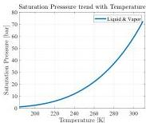
(a)

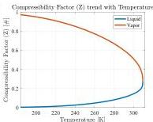
(b)

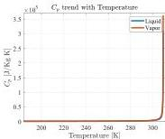
(c)

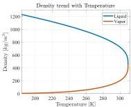
(d)

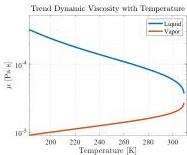
(e)

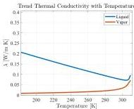
(f)
Figure 1. Trend of  $\mathrm{N}_2\mathrm{O}$  transport and thermophysical properties, in saturation conditions, computed with REFPROP data [7]: (a) saturated pressure and temperature; (b) compressibility factor and temperature; (c) isobaric specific heat and temperature; (d) density and temperature; (e) thermal conductivity and temperature; (f) dynamic viscosity and temperature.

# 3. Self-Pressurization Model

A self-pressurizing system is based on the implementation of the fluid vapor pressure values in the tank to drain the fluid from the storage vessel itself. As the tank corresponds to the highest pressure points of the pressurized system, all the utilities downstream are designed to work at a lower operating point. In addition, all pressure losses in the system shall be precisely predicted and characterized. This section presents a brief overview of the 0D and 0D/1D hybrid models available in literature: other more sophisticated approaches

<!-- page 4 -->

(such as CFD simulation frameworks) are out of the scope of this paper and are neglected. In literature, a limited number of models for the prediction of nitrous oxide behavior drained from a tank are present. The three most relevant 0D models are:

Homogeneous Equilibrium Model (HEM);
- Casalino and Pastrone Model (CP);
Zilliac and Karabeyoglu Model (ZK).

Furthermore, Zimmerman has developed a more sophisticated 0D/1D model, which allows for the prediction of the evolution and development of bubbles in the fluid [8]. All the models listed above have been specifically developed for the draining of nitrous oxide in liquid phase.

# Common Model Features

As reported by Zimmerman in [8], the aforementioned models share many similar features.

First, all the proposed models divide the tank into multiple regions; each one is represented by a single node with averaged properties. Figure 2a shows all the nodes implemented to achieve a precise domain discretization. These are the liquid, the vapor, the portion of the tank in contact with the liquid, and the portion of the tank wall in contact with the vapor, respectively. In addition, in Figure 2b, all the different heat and mass transfer processes occurring between the nodes are numbered [9]. Depending on the model, a reduced number of contributions may be considered. The transfer processes are:

1. Mass flow of liquid nitrous oxide out of the tank;
2. Heat and mass transfer from the vapor to the liquid via condensation, diffusion and convection;
3. Heat and mass transfer from the liquid to the vapor via boiling, evaporation, diffusion, and condensation;
4. Heat transfer to the liquid from the wall portion in contact with it;
5. Heat transfer to the vapor from the wall portion in contact with it;
6. Heat transfer from the environment to the liquid side of the tank wall;
7. Heat transfer from the environment to the vapor side of the tank wall; heat and mass transfer from the liquid side of the tank wall to the vapor side via conduction and motion of the boundary.

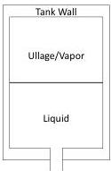
(a)

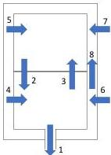
(b)
Figure 2. Diagram showing the nodes (a) and the heat and mass transfer process between the phases (b).

All the models share the same governing equations for mass and energy conservation. The mass conservation equation is defined as:

$$
\frac {d m}{d t} = \sum (\dot {m}) _ {i n} - \sum (\dot {m}) _ {o u t} \tag {1}
$$

<!-- page 5 -->

The general form of the energy conservation equation is given by:$$\frac{dE}{dt} = \sum\left\lbrack {\overset{˙}{m}\left({h + \frac{v^{2}}{2} + gz} \right)} \right\rbrack_{in} - \sum\left\lbrack {\overset{˙}{m}\left({h + \frac{v^{2}}{2} + gz} \right)} \right\rbrack_{out} + \overset{˙}{Q}_{in} + \overset{˙}{W}_{in}$$ where $\overset{˙}{Q}_{in}$ is the rate of net heat input, $\overset{˙}{W}_{in}$ is the rate of net work output and $\frac{dE}{dt}$ is the rate of accumulation of the total energy within the control volume.

## 4 Mass Flow Rate Models

Most of the models present in the literature still lack accuracy in predicting a self-pressurized nitrous oxide draining phenomenon. This is due to the presence of multiple phases occurring at the same time in the closed vessel, which defy the implementation of a universal predictive model.

This section presents a brief overview of the main mass flow rate models available in literature for self-pressurized nitrous oxide applications. The main four models are: Single Phase Incompressible (SPI);Single Phase Compressible (SPC);Homogeneous Equilibrium Model (HEM);Dyer Model.

### 4.1 Single Phase Incompressible Model

In the SPI model [10], the theoretical mass flow rate is related to the pressure differential between the section upstream (1) and downstream (2) of the orifice. It is computed by means of the imposition of the continuity and Bernoulli equations. An empirical correction factor (*C*_{*d*}) is then applied to obtain the actual flow rate. The assumptions are: steady flow;incompressible flow (*ρ*_{1} = *ρ*_{2} = *ρ* across the orifice);Flow along a streamline;No frictionUniform pressure and velocity before and after the orifice;No height variations across the orifice (*z*_{1} = *z*_{2} = *z*).

The corresponding mass flow rate is given by Equation (3):$$\overset{˙}{m}_{SPI} = C_{d} \cdot A_{2}\sqrt{2\rho\left(P_{1} - P_{2} \right)}\sqrt{\frac{1}{1 - \beta^{4}}}$$ where A_{2} is the orifice area, C_{d} is the orifice discharge coefficient, β is the ratio between the orifice and the pipe diameter, while P_{1} and P_{2} are the upstream and downstream pressure, respectively. Generally, for small orifices, β could be neglected since it is usually lower than 0.25 [1].

### 4.2 Single Phase Compressible

The classical SPI equation is often used in practical applications to predict the mass flow rate of traditional liquid propellants (for example *L**H*_{2} and *L**O*_{2}) through an injector orifice with sufficient accuracy. Unfortunately, errors are often introduced with this method for the injection of high vapor pressure propellants such as nitrous oxide [1]. In fact, operative conditions are usually close to the critical point of the fluid, far from ideal gas assumptions.

To account for compressibility effects, under the same assumption of the SPI model, a correction factor Y can be defined [11], which consists of the ratio of mass flow rates between the real compressible condition and the incompressible model (Equation (4)):$$Y = \frac{\overset{˙}{m}_{SPC}}{\overset{˙}{m}_{SPI}}$$

<!-- page 6 -->

$\dot{m}_{SPC}=C_{d}YA_{2}\sqrt{2\rho_{1}(P_{1}-P_{2})}$ (5)

For an ideal gas and for small pipe-to-diameter ratios ($\beta\rightarrow 0$), the compressibility correction factor is well known and can be computed in the following way [12] (Equation (6)):

$Y=\sqrt{\left(\frac{P_{2}}{P_{1}}\right)^{2/\gamma}\left(\frac{\gamma}{\gamma-1}\right)\left(\frac{1-\left(\frac{P_{1}}{P_{1}}\right)^{(\gamma-1)/\gamma}}{1-\left(\frac{P_{2}}{P_{1}}\right)}\right)}$ (6)

where $\gamma$ is the ratio between the isobaric specific heat ($c_{p}$) and the isochoric specific heat ($c_{v}$).

For compressible liquids or real gases, the correction factor should be calculated in the same fashion of Zimmerman et al. [13]. It is based upon the non-ideal gas flow power law theory of Cornelius and Srinivas [14]. This form of the compressible liquid correction factor, $Y^{\prime}$, is outlined in Equation (7). It is also valid for injectors but only under the assumption of isentropic flow through it [14]:

$Y^{\prime}=\sqrt{\frac{P_{1}}{2\Delta P}\left(\frac{2n}{n-1}\right)\left(1-\frac{\Delta P}{P_{1}}\right)^{\frac{2}{n}}\left[1-\left(1-\frac{\Delta P}{P_{1}}\right)^{\frac{n-1}{n}}\right]}$ (7)

where $\Delta P$ is the difference between the pressure upstream and downstream of the orifice, and n is the isentropic power law exponent for real gas. This equation as mentioned by Cornelius et al. [14] is valid only for $n>1$, where $n$ is defined as [8]:

$n=\gamma\left[\frac{Z+T\left(\frac{\partial Z}{\partial T}\right)_{\rho}}{Z+T\left(\frac{\partial Z}{\partial T}\right)_{p}}\right]$ (8)

Since nitrous oxide can be described by the real gas equation of state $PV=ZRT$, the derivatives can be approximated as:

$\left(\frac{\partial Z}{\partial T}\right)_{p}=\frac{P}{R^{2}}\left[\frac{1}{T}\left(\frac{\partial V}{\partial T}\right)_{p}-\frac{V}{T^{2}}\right]\qquad\left(\frac{\partial Z}{\partial T}\right)_{\rho}=\frac{1}{\rho R^{2}}\left[\frac{1}{T}\left(\frac{\partial P}{\partial T}\right)_{\rho}-\frac{P}{T^{2}}\right]$ (9)

All the parameters present in Equation (9) can be computed using CoolProp [15].

In order to account for a chocked flow condition, it is necessary to define a critical pressure ratio. The latter maximizes Equation (10) that is obtained by substituting the definition of $Y^{\prime}$ (Equation (7) into Equation (5)) [14]:

$\dot{m}_{SPC}=C_{d}A_{2}\sqrt{2\rho_{1}P_{1}\left(\frac{n}{n-1}\right)\left[\left(\frac{P_{2}}{P_{1}}\right)^{\left(\frac{2}{n}\right)}-\left(\frac{P_{2}}{P_{1}}\right)^{\left(\frac{n+1}{n}\right)}\right]}$ (10)

Then, in the case of real gases, the critical pressure ratio for which Equation (10) shows a maximum is:

$\frac{P_{2}}{P_{critical}}=\left(\frac{2}{n+1}\right)^{\left(\frac{n}{n-1}\right)}$ (11)

Finally, the critical mass flow rate is obtained by substituting back Equation (11) into Equation (10):

$\dot{m}_{SPC}=C_{d}A_{2}\sqrt{n\rho_{1}P_{1}\left(\frac{2}{n+1}\right)^{\left(\frac{n+1}{n-1}\right)}}$ (12)

However, even if the usage of a compressibility correction factor can provide improved accuracy of the SPI equation for single-phase liquid nitrous oxide injectors, the onset of

<!-- page 7 -->

a two-phase flow in the system becomes a greater concern. In fact, this phenomenon can overshadow the compressibility effects, making the classical form of the SPC equation unsuitable for nitrous oxide under certain operating conditions.

### 4.3. Homogeneous Equilibrium Model

In literature, several formulations for the two-phase mass flow rate are present: they are usually quite similar one to the other and are based on the homogeneous equilibrium model. In this paper, only the classical form used by Dyer et al. is presented [3]. The fundamental assumptions of the model are [1]:The two phase-mixture is homogeneous, i.e, the two phases are sufficiently well mixed. Thus, they can be described as a “pseudo-single phase” fluid with properties that are weighted averages of those of each phase;The liquid and vapor phases are in thermal equilibrium;There is no velocity difference between the phases;The flow is isentropic across the injector.

Since in this case a slip between the phases is not present, the vapor quality (static quality) is equal to the flow quality.

The generic thermodynamic variable at the orifice exit is given by:$$\phi_{2} = x\phi^{V} + (1 - x)\phi^{L}$$ where *ϕ* is a dummy variable. According to Equation (13), it is possible to write Equation (14) for the entropy:$$s_{2} = xs^{v} + (1 - x)s^{l}$$

Since the flow through the injector is assumed isentropic *s*_{2} = *s*_{1}, it is possible to retrieve the vapor quality, x. Then, with Equation (13) and Coolprop software, all of the thermodynamic parameters downstream from the orifice can be computed. Now, given that the total enthalpy between the upstream and downstream is conserved and the value of *h*_{2} is known from Equation (13), the downstream velocity is computed in Equation (15):$$v_{2} = \sqrt{2(h_{1} - h_{2})}$$

Substituting the velocity inside the continuity equation evaluated on the exit section, the result is the HEM mass flow rate (Equation (16)):$$\dot{m}_{HEM} = C_{d}A_{2}\rho_{2}\sqrt{2(h_{1} - h_{2})}$$

The mass flow rate predicted by the HEM model underestimates experimental data in small orifices [1]. This discrepancy is due to the fact that the finite rate of mass transfer between the liquid and vapor phases does not allow for the flow to remain in thermodynamic equilibrium. Indeed, liquids can often depressurize isothermally well below their vapor pressure if there are not readily available nucleation sites for bubble initiation [3]. Furthermore, experimental data indicate that a reliable mass flow rate model should account for both Single-Phase Incompressible Liquid flow and Homogeneous Equilibrium Model [3].

From the literature, it has been observed that, when considering long channels, the fluid has sufficient time to reach equilibrium: therefore, it can be modeled with adequate accuracy using HEM model. Instead, in short channels, the fluid has less time and space to nucleate vapor bubbles and therefore non-equilibrium phenomena may become important [3].

The identification of the critical condition for the HEM is not widely discussed in literature, hence there is not a general and validated procedure for such task. For this reason, the authors decided to compute numerically the chocked flow condition. The definition of chocking is retrieved as the pressure ratio value for which the mass flow rate presents a maximum peak: this condition is retrieved by keeping constant the pressure

<!-- page 8 -->

upstream from the orifice and varying the exit pressure. To apply this method, the mass flow rate was computed by varying the orifice downstream pressure from 1 bar to the maximum upstream pressure. This has to be done for all the upstream pressures of interest. Figure 3 shows this methodology applied to a set of upstream conditions ranging between 56 bar and 1 bar. Pressure ratios were then calculated to guarantee maximum mass flow for each inlet pressure value. The principal disadvantage of this methodology is associated with the relatively high computational effort required.

### 4.4. Dyer Model

Dyer et al. [3] developed a methodology, subsequently corrected by Solomon [16], which combines two different mass flow rate models: the Single Phase Incompressible Model and the Homogeneous Equilibrium Model (HEM). According to Dyer et al. [3], the non-equilibrium effects were predominantly caused by two processes: superheating of the liquid during expansion and finite vapor bubble growth rate.

To include these effects during calculations, Dyer proposed a non-equilibrium coefficient κ. The latter, neglecting all the constants parameters, is defined as the ratio between the characteristic bubble growth time (τ_{b}) and the characteristic fluid residence time (τ_{r}) in the orifice. The non-equilibrium coefficient is defined as:$$\kappa = \sqrt{\frac{P_{1} - P_{2}}{P_{v} - P_{2}}} \propto \frac{\tau_{b}}{\tau_{r}}$$

As described by Dyer et al. [3], the characteristic bubble growth time is defined to account for the finite rate of the vapor bubble growth:$$\tau_{b} \propto \sqrt{\frac{\rho_{l}}{P_{v1} - P_{2}}}$$

The residence time of the liquid in the injector element is inversely proportional to the velocity of the flow:$$\tau_{r} \propto \sqrt{\frac{\rho_{l}}{2\Delta P}}$$

Although in the Dyer paper the weighting parameters appear to have physical meaning, the bubble growth time reported in Dyer's paper dimensionally is not a time

<!-- page 9 -->

(Equation (18)). However, this dimensional inconsistency does not affect the physical meaning of the Dyer model, since the non-equilibrium coefficient is defined using the ratio between the pressures, therefore without any influence of the constant values. For this reason, the authors decide to impose the proportionality and do not use the formula reported by Dyer.

The Dyer model accounts for non-equilibrium effects by allowing the flow to vary smoothly between the one predicted by Homogeneous Equilibrium Model and the one of the Single Phase Incompressible Model. This form of the Dyer model is shown in Equation (20) and is referred by Solomon [16] as a Generalized Non-Homogeneous Non-Equilibrium (NHNE) model:$$\overset{˙}{m}_{NHNE} = \left({\left({1 - \frac{1}{1 + \kappa}} \right)\overset{˙}{m}_{SPI} + \frac{1}{1 + \kappa}\overset{˙}{m}_{HEM}} \right)$$

This model attempts to account for the fact that, when the residence time of bubble *τ*_{*r*} is much lower than the characteristic time for bubble growth *τ*_{*b*}, very little vapor will be formed at the exit. Consequently, the single-phase assumption is probably valid. However, when *τ*_{*b*} < < *τ*_{*r*}, the mass flow rate should be close to the value predicted by the Homogeneous Equilibrium Model. Indeed, for injectors with high length to diameter ratio, it has been observed that the fluid has more time to reach thermodynamic equilibrium.

Despite the fact that the model is quite accurate for the prediction of the two-phase nitrous oxide mass flow rate through a small orifice, it presents two major limitations:The model cannot account for chocked flow condition across the orifice [9];If applied to predict the mass flow rate drained from a tank under equilibrium condition, k becomes equal to one. This leads to a simple algebraic average of the two mass flow rate contributions losing its non-equilibrium contribution across the orifice. In fact, even if the self-pressurization model is intrinsically of equilibrium, it may present variation in the drained phase. This may depend on the pressure jump across the orifice and on the upstream orifice condition that may lead to a higher single phase or two-phase contribution.

In order to overcome these two limitations, the authors proposed a new mass flow model that is a variation of the original Dyer model corrected by Solomon [16]. This model falls under the Generalized Non-Homogeneous Non-Equilibrium category, since it is a direct derivation and is based on the same assumptions of the Dyer model.

## 5. Proposed Model: Foletti--Magni--La Luna (FML)

The primary objective was to improve the accuracy through which the model weights the two mass flow contributions in applications where the tank is in a saturated condition. Instead of the non-equilibrium coefficient suggested by Solomon [16] in Equation (17), the mass flow weighing approach utilizes the void fraction downstream the orifice, which is computed as a function of the downstream static quality and the slip-ratio. The fluid static quality is computed through the isentropic assumption, as done for the HEM in Section 4.3 in Equation (14), while the slip velocity is defined as suggested by Zivi [17]:$$S = \left(\frac{\rho_{2l}}{\rho_{2v}} \right)^{\left(\frac{1}{3} \right)}$$

Following this methodology, the way the void fraction weights the mass contribution is different if applied to a liquid or to a vapor phase draining. In the former case, if the predominant phase found at the exit of the orifice through an isotropic expansion is mainly vapor, the fluid undergoes a significant flashing and so the two-phase mass flow rate contribution is more relevant. In the latter case, if the drained fluid is mostly in liquid phase at the injector exit, the flow across the orifice can be easily modeled through the single phase compressible model.

<!-- page 10 -->

Opposite considerations apply to vapor discharge. The other main difference with respect to Dyer is that the model uses different mass flow rate contributions. Instead of the SPI, it implements the SPC model to account for the fluid compressibility. Furthermore, the model is capable of accounting for the fluid chocking across the orifice. For liquid phase draining, the FML mass flow rate becomes (Equation (22)):

$\dot{m}_{NHNE}=((1-\alpha_{2})\cdot\dot{m}_{SPC}+\alpha_{2}\cdot\dot{m}_{HEM_{c}})$ (22)

while, for a vapor phase, draining the void fraction weighting contribution shall be rewritten as (Equation (23)):

$\dot{m}_{NHNE}=(\alpha_{2}\cdot\dot{m}_{SPC}+(1-\alpha_{2})\cdot\dot{m}_{HEM_{c}})$ (23)

where the downstream void fraction is defined as:

$\alpha_{2}=\frac{1}{1+\frac{1-x_{2}}{x_{2}}S\frac{\rho_{2c}}{\rho_{2l}}}$ (24)

As a criterion for the on-set of the chocking condition, the model implements a single threshold for both the contributions (SPC and HEM). This criterion is similar to the one previously explained in Section 4.2 for the SPC model.

## 6 Experimental Setup and Preliminary Model Validation

For the model validation, a dedicated experimental set-up was developed. Two variants were implemented both for vapor and liquid phase draining. The test setup consisted of a draining tank, three pressure transmitters (Keller P-21C, full scale 75 bar), a Coriolis mass flow meter, and a 1 mm diameter calibrated orifice. The feeding line presented a nominal diameter of 1/4″. The pressure transmitters were placed on the nitrous oxide tank for the monitoring of the vessel pressure and upstream and downstream from the orifice to correctly measure the pressure drop imposed by the chocking. Figure 4 shows the P&ID (Piping and Instrumentation Diagram) of the first experimental setup. It consists of the direct draining of nitrous oxide in liquid phase from a standard bottle in the upside-down position. The tank has a volume of 10 liters. In addition, it was possible to qualitatively observe the phase drained from the experimental setup main valve through a camera.

Figure 5 shows the P&ID diagram of the second experimental setup.

<!-- page 11 -->

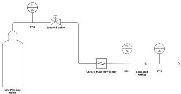
Figure 5. Experimental setup 2 P&amp;ID Diagram, configuration for a vapor drain test.

The second experimental setup was similar to the previous one, with the only difference being that the bottle was not upside down.

The first experimental setup (Figure 4) is the most significant for the model validation since the usage of two-phase models is more relevant for the liquid phase draining. Indeed, nitrous oxide almost always changes phase along the feeding line and flashes across the orifice when drained from a tank leading to a two-phase fluid behavior.

The aim of the second experimental setup (Figure 5) is to investigate if the elaborated model with the void fraction is capable of predicting the gas discharge, performing also a comparison with Dyer's model.

To compute the mass flow rate, the orifice upstream pressure experimentally measured was used in order to minimize the inaccuracy introduced by the pressure losses along the feeding. In addition, saturation conditions inside the tank were imposed. The latter assumption was forced by the fact that the correct temperature value of the drained phase was not available.

# 7. Results

This section shows the comparison between the experimental average mass flow rate and the one predicted by the FML and Dyer's model. To make a meaningful comparison, the draining coefficient was computed through a semi-empirical relation based on the Reynolds number, the length to diameter ratio, and the sharp edge coefficient [2]. By applying the relation, the discharge coefficient is defined as:

$$
C _ {d} = \frac {1}{\sqrt {4 C _ {f} \frac {L}{D} + K}} \tag {25}
$$

Following the procedure described by Niño and Razavi [2], the Fanning friction factor is computed:

$$
C _ {f} \approx 0. 0 7 9 1 R e _ {D} ^ {- 1 / 4} \tag {26}
$$

The excess pressure drop constant,  $\mathrm{K}$ , is set to 2.28 for sharp-edge inlets [2]. The predicted value of  $C_d$  with this relation is approximately 0.6 for liquid draining, which is reasonable and lies within the ranges indicated by Sutton [18].

Table 2 shows the results retrieved with the first experimental set-up.

<!-- page 12 -->

Table 2. Comparison between the average experimental mass flow rate and the one predicted by the FML and Dyer's model for the first experimental setup.

|   | Initial P (bar) | Duration (s) | Exp. MFR (g/s) | FML MFR (g/s) | Dyer MFR (g/s) | FML Error (%) | Dyer Error (%)  |
| --- | --- | --- | --- | --- | --- | --- | --- |
|  Test 1 | 69.0 | 10 | 18.31 | 20.74 | 24.58 | 13.28 | 34.26  |
|  Test 2 | 66.2 | 5 | 14.94 | 19.53 | 24.56 | 30.68 | 64.37  |
|  Test 3 | 69.5 | 5 | 16.42 | 14.86 | 24.72 | 9.54 | 50.49  |
|  Test 4 | 69.2 | 5 | 16.28 | 14.52 | 24.85 | 10.84 | 52.64  |
|  Test 5 | 60.3 | 5 | 14.93 | 22.28 | 23.91 | 49.20 | 60.21  |
|  Test 6 | 60.0 | 5 | 14.86 | 22.12 | 24.12 | 48.84 | 62.26  |
|  Test 7 | 61.1 | 5 | 15.24 | 21.81 | 24.39 | 43.14 | 60.07  |
|  Test 8 | 60.2 | 5 | 17.26 | 22.53 | 24.19 | 30.50 | 40.14  |
|  Test 9 | 66.3 | 10 | 14.72 | 17.02 | 24.73 | 15.61 | 68.00  |
|  Test 10 | 70.1 | 10 | 16.77 | 13.04 | 24.97 | 20.86 | 51.55  |
|  Test 11 | 72.0 | 5 | 15.05 | 12.93 | 24.86 | 14.08 | 65.20  |

The errors, indicated in Table 2, are defined according to Equation (27)

$$
\text {R e l a t i v e d e v i a t i o n} [ \% ] = a b s \left(\frac {M F R _ {\text {m o d e l}}}{M F R _ {\text {e x p e r i m e n t a l}}} - 1\right) \cdot 1 0 0 \tag{27}
$$

Figure 6 shows the plot of experimental mass traces and the ones predicted by the models for the different tests presented above.

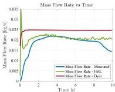
(a)

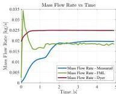
(b)

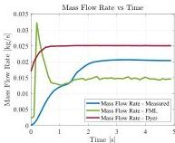
(c)
Figure 6. Cont.

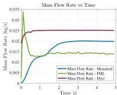
(d)

<!-- page 13 -->

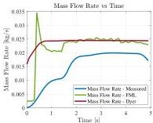
(e)

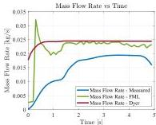
(f)

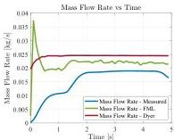
(g)

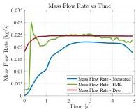
(h)

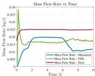
(i)

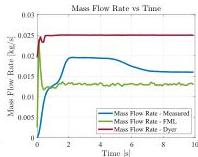
(j)

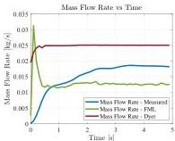
(k)
Figure 6. Comparison between the experimental mass flow rate and the one predicted from the FML and Dyer's model, for the first experimental setup. (a) Test 1; (b) Test 2; (c) Test 3; (d) Test 4; (e) Test 5; (f) Test 6; (g) Test 7; (h) Test 8; (i) Test 9; (j) Test 10; (k) Test 11.

Table 3 shows the results retrieved with the second experimental set-up.

<!-- page 14 -->

Table 3. Comparison between the average experimental mass flow rate and the one predicted by the FML and Dyer's model for the second experimental setup.

|   | Initial P (bar) | Duration (s) | Exp. MFR (g/s) | FML MFR (g/s) | Dyer MFR (g/s) | FML Error (%) | Dyer Error (%)  |
| --- | --- | --- | --- | --- | --- | --- | --- |
|  Test 1 | 67.34 | 5 | 11.56 | 13.61 | 15.32 | 17.73 | 32.53  |
|  Test 2 | 67.20 | 5 | 10.95 | 13.49 | 15.22 | 23.19 | 38.97  |
|  Test 3 | 66.97 | 5 | 10.92 | 12.72 | 14.41 | 16.48 | 31.87  |
|  Test 4 | 69.80 | 10 | 11.97 | 14.54 | 16.19 | 21.49 | 35.33  |
|  Test 5 | 68.40 | 10 | 12.23 | 14.06 | 15.77 | 14.97 | 28.99  |

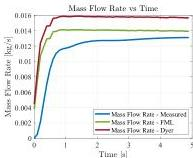
Figure 7 shows the plot of experimental mass traces and the ones predicted by the models for the different tests presented above.
(a)

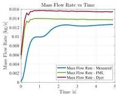
(b)

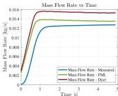
(c)

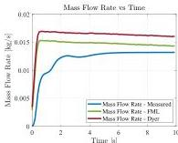
(d)

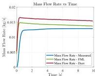
(e)
Figure 7. Comparison between the experimental mass flow rate and the one predicted from the FML and Dyer's model, for the second experimental setup. (a) Test 1; (b) Test 2; (c) Test 3; (d) Test 4; (e) Test 5.

<!-- page 15 -->

8. Discussion and Comments

By analyzing the experimental data presented above in Section 7, the new proposed mass flow model presents a high accuracy in predicting the mass flow rate of a self-pressurizing propellant. In particular, the model has several advantages if compared to the Dyer one. First of all, it shows a higher accuracy in the prediction of the experimental mass flow rate for a tank in equilibrium condition. This aspect is of paramount importance for experimental and design purposes. Indeed, in order to correctly apply Dyer's model, the knowledge of both temperature/density and pressure of the drained phase is required; otherwise, in case the model is applied under the hypothesis of saturation conditions, it performs a simple algebraic average of the two mass flow rate contributions. Differently, the FML model utilizes as a weighting factor the downstream void fraction computed under the isentropic assumption. This guarantees a better weighting of the two mass flow rate contributions present in the equation. Consequently, it allows for achieving a better prediction of the actual mass flow rate, even if the real conditions in the tank are unknown.

Furthermore, the model shows a solid physical background. In fact, as confirmed by experimental results, during the vapor phase discharge, the void fraction always remains close to one, which means that the phase exiting from the orifice is mainly vapor.

For what concerns the mass flow rate traces prediction shown in Figure 6 and Figure 7, both models are incapable of exactly mimicking the experimental ones. In particular, the mass flow model proposed in this paper shows a peculiar peak at the end of the initial transient, which is not physical. The latter is probably due to the estimation of the chocking conditions, which leads to a maximum at the end of the initial transient due to the on-set of the critical flow. This causes a sudden decrease in the computed void fraction, which causes the aforementioned peak. On the contrary, Dyer's model seems to have a smoother path, less influenced by the variability of the upstream state, due to the absence of the chocking conditions. Consequently, the main drawback of the model is that it is incapable of correctly predicting the initial transient of the mass flow rate. However, this is not of paramount importance for common propulsive applications since thruster performances are usually characterized on the equilibrium mass flow rate value.

A further consideration can be done for tests 5, 6, and 7. As shown in Table 2, the mass flow models present lower accuracy maybe related to the sudden increase in pressure, which is visible in Figure 6e--g at approximately 1.5 s.

However, further experimental investigations are required in order to accurately assess the physical motivations behind these phenomena. An additional insight that comes out by the experiments is associated with the liquid chocking conditions. Figure 8 shows the valve conditions at the end of a liquid draining. As can be clearly seen, the valve is completely frozen downstream from the orifice. This condition is probably associated with the fast expansion that occurs downstream from the chocking point inside the orifice. The latter has been observed in all the tests, for both liquid and vapor phase draining (Figure 9).

<!-- page 16 -->

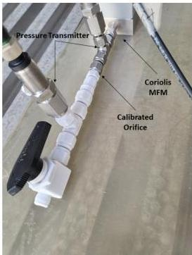
Figure 8. Image of the calibrated orifice at the end of a liquid draining test.

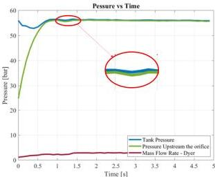
Figure 9. Test 7 experimental pressure trace, while highlighting the pressure rise that is possibly associated with the sudden peak in the mass flow rate.

# 9. Conclusions

The FML model presents a good level of accuracy in predicting the drained mass flow rate for both the liquid and vapor phase. In the presented test campaign, it always reported an error below  $30\%$  with the only exception being tests 5, 6, and 7, as already discussed in Section 8. In particular, it shows a greater, or at least comparable, accuracy with respect to Dyer's model. Further studies may be required to validate the proposed model for a tank in non-saturated conditions. In such case, a detailed comparison between the mass flow rate weighing criteria of the downstream void fraction  $(\mathrm{a}_2)$  for the model proposed here

<!-- page 17 -->

and the non-equilibrium coefficient (k) for the Dyer one could be useful. Nevertheless, for the above considerations, the authors consider possibly minimizing the percentage errors of the model, dealing with two different aspects:Feeding line simplification;C_{d} characterization.

The authors consider the first point the main element of percentage error production shown before; in fact, a simplification of the feeding line would allow for the simplification of the downstream feeding line, avoiding a bad reading of the pressure (P_{2}) due to tube enlargement—from a 1 mm orifice to $\frac{1}{4}$ tube. In addition, the verification of the FML framework proposed here with other media, different from nitrous oxide, shall be assessed.

In conclusion, the most significant advantage of the model proposed here is that it guarantees a good accuracy in the mass flow rate prediction with the usage of a numerically computed discharge coefficient (C_{d}). Furthermore, the FML does not require the knowledge of the exact in-tank fluid conditions, which are seldom available, but it allows for making the simplifying assumption of saturated fluid. These characteristics are both fundamental for propulsive applications, due to allowing a better prediction of the injected mass, and consequently a better characterization of the engine performance, as well as for the refueling system, by guaranteeing an adequate prediction of the fluid transfer time.

Conceptualization, S.L.L. N.F. L.M. and D.Z.; methodology, S.L.L. D.Z. and F.M.; software, S.L.L. N.F. and L.M.; validation, S.L.L. N.F. L.M. and D.Z.; formal analysis, S.L.L.; investigation, S.L.L. N.F. L.M. and D.Z.; resources, S.L.L. N.F. L.M. D.Z. and F.M.; data curation, L.M.; writing—original draft preparation, S.L.L, N.F. and L.M.; writing—review and editing, D.Z. and F.M.; supervision, F.M. All authors have read and agreed to the published version of the manuscript.

The data presented in this study are available on request from the corresponding author. The data are not publicly available because they are sensitive data.

The authors declare no conflict of interest.

MDPI Multidisciplinary Digital Publishing Institute DOAJ Directory of Open Access Journals TLA Three Letter Acronym LD Linear Dichroism ZK Zilliac & Karabeyoglu Model CP Casalino & Pastrone Model EQ Equilibrium Model FML Foletti--Magni--La Luna Model IUPAC International Union of Pure and Applied Chemistry NIST National Institute of Standards and Technology CFD Computational Fluid Dynamics HEM Homogeneous Equilibrium Model SPC Single Phase Compressible SPI Single Phase Incompressible NHNE Non-Homogeneous Non-Equilibrium Model P&ID Piping and Instrumentation Diagram MFR Mass Flow Rate MFM Mass Flow Meter PT Presure Transducer

<!-- page 18 -->

# Nomenclature

|  m | Mass Flow Rate [kg/s]  |
| --- | --- |
|  Q | Heat Flux [J/s]  |
|  W | Work Flux [J/s]  |
|  α | Void Fraction [-]  |
|  β | Ratio of Orifice Diameter to Pipe Diameter [-]  |
|  γ | Specific Heat Ratio [-]  |
|  φ | Generic Thermodynamic Variable [-]  |
|  ρ | Density [kg/m3]  |
|  τb | Characteristic Bubble Growth Time [s]  |
|  τr | Resident Time in the Injector Element [s]  |
|  A | Orifice Area [m2]  |
|  Cd | Discharge Coefficient [-]  |
|  Cf | Skin-Friction Factor [-]  |
|  E | Total Energy [J]  |
|  g | Gravity Acceleration [m/s2]  |
|  h | Enthalpy [J/kg]  |
|  K | Excess Pressure Drop Constant [-]  |
|  k | Non-Equilibrium Coefficient [-]  |
|  m | Mass [kg]  |
|  n | Isentropic Power Law Exponent for Real Gas [-]  |
|  P | Pressure [Pa]  |
|  R* | Specific Universal Gas Constant [J/kg K]  |
|  S | Phase Slip Velocity [-]  |
|  s | Specific Entropy [J/kg K]  |
|  T | Temperature [K]  |
|  V | Fluid Specific Volume [kg/m3]  |
|  v | Fluid Speed [m/s]  |
|  x | Fluid Static Quality [-]  |
|  Y | Compressibility Correction Factor [-]  |
|  Z | Fluid Compressibility [-]  |
|  z | Height [m]  |

# References

1. Waxman, B.S. An Investigation of Injectors for Use with High Vapor Pressure Propellants with Applications to Hybrid Rockets. Ph.D. Thesis, Stanford University, Palo Alto, CA, USA, 2014.
2. Vargas Niño, E.; Razavi, M.R.H. Design of Two-Phase Injectors Using Analytical and Numerical Methods with Application to Hybrid Rockets. In Proceedings of the AIAA Propulsion and Energy 2019 Forum, Indianapolis, IN, USA, 19–22 August 2019; American Institute of Aeronautics and Astronautics: Indianapolis, IN, USA, 2019.
3. Dyer, J.; Zilliac, G.; Sadhwani, A.; Karabeyoglu, A.; Cantwell, B. Modeling Feed System Flow Physics for Self-Pressurizing Propellants. In Proceedings of the 43rd AIAA/ASME/SAE/ASEE Joint Propulsion Conference &amp; Exhibit, Cincinnati, OH, USA, 8-11 July 2007; American Institute of Aeronautics and Astronautics: Cincinnati, OH, USA, 2007.
4. Karabeyoglu, A.; Dyer, J.; Stevens, J.; Cantwell, B. Modeling of N2O Decomposition Events. In Proceedings of the 44th AIAA/ASME/SAE/ASEE Joint Propulsion Conference &amp; Exhibit, Hartford, CT, USA, 21-23 July 2008; American Institute of Aeronautics and Astronautics: Hartford, CT, USA, 2008.
5. Zakirov, V.; Sweeting, M.; Lawrence, T.; Sellers, J. Nitrous oxide as a rocket propellant. Acta Astronaut. 2001, 48, 353-362. [CrossRef]
6. Merril, C. Nitrous Oxide Explosive Hazard; Air Force Research Lab Edwards AFB CA Propulsion Directorat: Boron, CA, USA, 2008.
7. Lemmon, E.; Bell, I.H.; Huber, M.L.; McLinden, M.O. NIST Standard Reference Database 23: Reference Fluid Thermodynamic and Transport Properties-REFROP, Version 10.0; Standard Reference Data Program; National Institute of Standards and Technology: Gaithersburg, MD, USA, 2018.
8. Zimmerman, J.E. Self-Pressurizing Propellant Tank Dynamics. Ph.D. Thesis, Stanford University, Palo Alto, CA, USA, 2015.
9. Zimmerman, J.E.; Waxman, B.S.; Cantwell, B.; Zilliac, G. Review and Evaluation of Models for Self-Pressurizing Propellant Tank Dynamics. In Proceedings of the 49th AIAA/ASME/SAE/ASEE Joint Propulsion Conference, San Jose, CA, USA, 14-17 July 2013; American Institute of Aeronautics and Astronautics: San Jose, CA, USA, 2013.
10. Fox, R.W.; Pritchard, P.J.; McDonald, A.T. Fox and McDonald's Introduction to Fluid Mechanics, 8th ed.; John Wiley &amp; Sons, Inc.: Hoboken, NJ, USA, 2011.

<!-- page 19 -->

11. Waxman, B.S.; Cantwell, B.; Zilliac, G.; Zimmerman, J.E. Mass Flow Rate and Isolation Characteristics of Injectors for Use with Self-Pressurizing Oxidizers in Hybrid Rockets. In Proceedings of the 49th AIAA/ASME/SAE/ASEE Joint Propulsion Conference, San Jose, CA, USA, 14–17 July 2013; American Institute of Aeronautics and Astronautics: San Jose, CA, USA, 2013.
12. Perry, R.H.; Green, D.W. Perry's Chemical Engineers' Handbook, 8th ed.; McGraw-Hill: New York, NY, USA, 2008.
13. Zimmerman, J.; Cantwell, B.; Zilliac, G. Initial Experimental Investigations of Self-Pressurizing Propellant Dynamics. In Proceedings of the AIAA 2012-4198, Atlanta, GA, USA, 30 July–1 August 2012; American Institute of Aeronautics and Astronautics: Atlanta, GA, USA, 2012.
14. Cornelius, K.C.; Srinivas, K. Isentropic Compressible Flow for Non-Ideal Gas Models for a Venturi. J. Fluids Eng. 2004, 126, 238–244. [CrossRef]
15. Bell, I.H.; Wronski, J.; Quoilin, S.; Lemort, V. Pure and Pseudo-pure Fluid Thermophysical Property Evaluation and the Open-Source Thermophysical Property Library CoolProp. Ind. Eng. Chem. Res. 2014, 53, 2498–2508. [CrossRef] [PubMed]
16. Solomon, B.J. Engineering Model to Calculate Mass Flow Rate of a Two-Phase Saturated Fluid through an Injector Orifice; Utah State University: Logan, UT, USA, 2011
17. Zivi, S.M. Estimation of Steady-State Steam Void-Fraction by Means of the Principle of Minimum Entropy Production. J. Heat Transf. 1964, 86, 247–251. [CrossRef]
18. Sutton, G.P.; Biblarz, O. Rocket Propulsion Elements, 7th ed.; John Wiley &amp; Sons: New York, NY, USA, 2001.