# $\mathbf{N}_2\mathbf{O}$ Mass Flow Modelling: State-of-the-Art and The New Dual SPC Model

Simone La Luna\*† Davide Zuin\* Filippo Maggi\*

\*Politecnico di Milano, DAER

Via La Masa 34, 20156 Milano, Italy

simone.laluna@polimi.it davide.zuin@polimi.it filippo.maggi@polimi.it

†Corresponding author

# Abstract

In recent years it is becoming increasingly important to expand knowledge about green propulsion and develop the technology of self-pressurization, considering their potential to replace hydrazine. Among the family of green propellants, one promising candidate to replace hydrazine is Nitrous Oxide which owns an interesting property: self-pressurization. This added value makes Nitrous Oxide one of the most 'green' propellants used in the new space market, where the miniaturization trend requires storability, simplicity, lightness, and reliability in terms of propulsion unit. In this paper a study on the mass flow behavior during the discharge process using Nitrous Oxide is presented. The research combines three interconnected aspects: an overview of mass flow rate models presents in the scientific panorama, the development of a new mathematical model, and a preliminary experimental validation. The proposed Dual SPC model offers improved accuracy, enhancing the design and performance optimization of hybrid rocket systems.

# 1. Introduction

Self-pressurization is a widely utilized phenomenon in industrial applications, allowing the expulsion of liquid or gas from a closed vessel using the internal energy of the stored substance. This technology eliminates the need for external pressurization devices or pumps, resulting in reduced system complexity, costs, and weight. It also simplifies feeding line design and system assembly, making it particularly valuable in critical applications like space propulsion. Moreover, the growing In Orbit Servicing (IOS) satellite industry requires accurate simulation methods to validate the dynamics of 'green' propellants commonly used in the new space satellite market. To address this need, various self-pressurized models have been developed over the past two decades. Among these models, one of the crucial design parameters is the ability to predict vessel draining time under self-pressurization conditions. However, achieving this prediction poses two main challenges:

- Mass flow rate
- Boiling

This paper focuses on accurately predicting the mass flow rate drained from the tank within the context of self-pressurizing propellants. Due to the high vapor pressure of these propellants, they tend to flash across the orifice, resulting in two-phase fluid behavior along the downstream feeding line. Previous draining analyses have attempted to address this issue through equilibrium and non-equilibrium methods, as well as dedicated simulation frameworks $^{2,3}$ . Continuous research is being conducted to overcome the limitations of current mass flow rate models such as HEM, Dyer, or FML, driven by the necessity to implement the most accurate mass flow rate model for IOS applications like satellite refueling. The first part of this paper provides the state-of-the-art of the models highlighting their advantages and challenges. It discusses the importance of accurately modeling the mass flow inside a propulsive system during discharge for optimal performance and for refuelling application. Next, a mathematical model is developed to predict the mass flow during discharge. The model starts from Dyer and FML models trying to overcome their limitations always accounting for multiphase flow characteristics. This model integrates the SPC and HEMc effects into a single equation. The new Dual SPC model demonstrates a good agreement with the experimental results, indicating its accuracy and reliability. Finally, the experimental test campaign is presented. Various liquid and vapor phase discharge tests were conducted under different operating conditions and durations. The experimental results are compared with

<!-- page 2 -->

the predictions of the developed mass flow models. The evaluation criteria focus on the models' ability to accurately predict the experimental mass flow behavior. The findings highlight the effectiveness of the Dual SPC model in accurately capturing the experimental results.

# 2. Mass Flow Rate State of the Art

In the literature, various mass flow rate models have been developed, classified into single-phase and two-phase models. These categories can be further divided into three sub-sections: homogeneous equilibrium models, non-homogeneous equilibrium models, and non-homogeneous non-equilibrium models. The definitions of these categories are as follows:4

- Homogeneous models assume that liquid and vapor can be treated as a mixture;
- Non-homogeneous models consider that liquid and vapor are separated phases and the slip between phases shall be taken into account;
- Equilibrium models assume that between the two phases there exist:

- Thermal equilibrium: both phases coexist at the same saturation conditions;
- Mechanical equilibrium: both phases are well-mixed, with equal velocity;
- Chemical equilibrium: both phases densities do not change throughout the expansion;

- Non-equilibrium models consider that the equilibrium conditions listed above are not satisfied.

Table 1 provides a summary of the single-phase and two-phase models available in the literature.2

Table 1: Mass flow rate models SOA.

|  Model Classification | Assumptions |   | Model Name  |
| --- | --- | --- | --- |
|  Single-Phase Models |  | SPI  |   |
|   |   |   |  SPC  |
|  Two-Phase Models | Thermodynamic Equilibrium | Homogeneous (S=1) | Homogeneous Equilibrium  |
|   |   |   |  Babitskiy  |
|   |   |  Non-Homogeneous (S≠1) | Moody  |
|   |  Thermodynamic Non-Equilibrium | Frozen (S≠1 but fixed) | Burnell  |
|   |   |   |  Zaloudek  |
|   |   |   |  Waxman  |
|   |   |  Generalized (S≠1) | Dyer  |
|   |   |   |  FML  |
|   |   |   |  Dual SPCnew  |

with  $S$  is the slip ratio that accounts for the non-homogeneous effects.

In the following paragraphs, we provide a brief description of the main models used in the scientific community for predicting mass flow rate.

# 2.1 Single Phase Incompressible

The single phase incompressible model is based on the following assumptions:

- Steady flow;
- Incompressible flow  $(\rho_{1} = \rho_{2})$
- Flow along a streamline;
- No friction;
- Uniform pressure and velocity upstream and downstream the orifice.

<!-- page 3 -->

The mass flow rate expression is:

$\dot{m}=C_{d}A_{2}\sqrt{\frac{2\rho\Delta P}{1-\left(\frac{A_{1}}{A_{1}}\right)^{2}}}$ (1)

Typically, $A_{2}\ll A_{1}$ and the above equation becomes:

$\dot{m}_{SPI}=C_{d}A_{2}\sqrt{2\rho(P_{1}-P_{2})}$ (2)

### 2.2 Single Phase Compressible

Operating conditions in injectors are often close to the critical point of Nitrous Oxide, resulting in a differentiation from the ideal case (SPI).*[2]* To account for compressibility effects, a compressibility correction factor, denoted as Y, is introduced:*[5]*

$Y=\frac{\dot{m}_{SPC}}{\dot{m}_{SPI}}$ (3)

The mass flow rate expression for the single phase compressible model becomes:

$\dot{m}_{SPC}=C_{d}YA_{2}\sqrt{2\rho(P_{1}-P_{2})}$ (4)

The compressibility correction factor for compressible liquids or real gases is computed as proposed by Zimmerman et al.*[6]*

$Y^{\prime}=\sqrt{\frac{P_{1}}{2\Delta\dot{P}}\left(\frac{2n}{n-1}\right)\left(1-\frac{\Delta P}{P_{1}}\right)^{\frac{1}{n}}\left[1-\left(1-\frac{\Delta P}{P_{1}}\right)^{\frac{n+1}{n}}\right]}$ (5)

This equation is valid for injectors assuming isentropic flow and in general for n $>$ 1*[7]* where $n$ is the ratio of specific heats, defined as:

$n=\gamma_{pv}=\gamma\left[\frac{Z+T(\frac{\partial Z}{\partial T})_{\rho}}{Z+T(\frac{\partial Z}{\partial T})_{P}}\right]$ (6)

The partial derivatives in the above equation are derived from the real gas equation of state $PV=ZRT$:

$\left(\frac{\partial Z}{\partial T}\right)_{\rho}=\frac{1}{\rho R^{*}}\left[\frac{1}{T}\left(\frac{\partial V}{\partial T}\right)_{\rho}-\frac{P}{T^{2}}\right]$ (7)
$\left(\frac{\partial Z}{\partial T}\right)_{P}=\frac{P}{R^{*}}\left[\frac{1}{T}\left(\frac{\partial V}{\partial T}\right)_{P}-\frac{V}{T^{2}}\right]$ (8)

Hence:

$\dot{m}_{SPC}=C_{d}A_{2}\sqrt{2\rho_{1}P_{1}\left(\frac{n}{n-1}\right)\left[\left(\frac{P_{2}}{P_{1}}\right)^{\frac{2}{n}}-\left(\frac{P_{2}}{P_{1}}\right)^{\frac{n+1}{n}}\right]}$ (9)

The critical pressure ratio corresponds to the condition for which the above mass flow rate shows a maximum value. This condition means that the flow is sonic at the orifice exit and this last is said to be ”choked”. The consequence is that the mass flow rate becomes only dependent on the upstream conditions.*[2]* The critical pressure ratio for real gases is:

$\frac{P_{2}}{P_{critical}}=\left(\frac{2}{n+1}\right)^{\left(\frac{n}{n-1}\right)}$ (10)

Consequently, the critical mass flow rate becomes:

$\dot{m}_{SPC}=C_{d}A_{2}\sqrt{n\rho_{1}P_{1}\left(\frac{2}{n+1}\right)^{\left(\frac{n+1}{n-1}\right)}}$ (11)

<!-- page 4 -->

N_{2}O MASS FLOW MODELLING: STATE-OF-THE-ART AND THE NEW DUAL SPC MODEL

### 2.3 Homogeneous Equilibrium Model

The two-phase HEM mass flow rate models present in the literature are the classical form and $\omega$.^{8} Along this paragraph the classical form will be explained since it will be used in the models described in the next paragraphs. The hypothesis behind these models are as follows:

- The model is classified as homogeneous because the two phases are considered as a mixture. This allows to describe the fluid properties by a weighted average of those of each phase;
- No slip ratio is considered and this means that it exists no difference in velocity between the two phases;
- Liquid and vapor are in thermal equilibrium;
- The flow is isentropic across the injector.

As mentioned earlier, the fluid properties are computed as a vapor fraction weighted average of the saturated vapor and liquid properties, respectively:

$x=\frac{m^{V}}{m^{L}+m^{V}}$ (12)
$\Phi_{2}=x\Phi^{V}+(1-x)\Phi^{L}$ (13)

where $\Phi$ is a dummy variable. By applying the isentropic assumption, the following equation is obtained:

$s_{2}=xs^{V}+(1-x)s^{L}\xrightarrow{s_{2}=s_{1}}x=\frac{s_{1}-s^{L}}{s^{V}-s^{L}}$ (14)

Here, $s^{L}$ and $s^{V}$ are computed as the equilibrium saturation values at the downstream pressure. Using the above equation expressed for $\Phi$, all the thermodynamic variables downstream of the orifice can be computed. Since the total enthalpy is conserved, the downstream velocity can be expressed as:

$V_{2}=\sqrt{2(h_{1}-h_{2})}$ (15)

Finally, substituting the above expression into the continuity equation evaluated at the exit section, the mass flow rate is retrieved:

$\dot{m}_{HEM}=C_{d}A\rho_{2}\sqrt{2(h_{1}-h_{2})}$ (16)

However, it is important to note that the HEM mass flow rates generally underpredict experimental data. This is because the flow is not in thermodynamic equilibrium due to the finite rate of mass transfer between the liquid and vapor phases. The HEM model accurately describes the fluid behavior in channels that are sufficiently long, allowing the fluid enough time to reach equilibrium. On the other hand, in short channels, the fluid has less time and space for vapor bubble nucleation, and non-equilibrium phenomena become important.^{9}

The critical pressure ratio for HEM is not widely discussed in literature. Therefore, two definition methods are proposed and followed: the definition based on the choke flow condition and the identification of the sound speed.
To determine the critical pressure ratio using the choke flow condition, the mass flow rate is computed by varying $P_{2}$ between 1 bar and 56 bar. The average of the pressure ratios that yield the maximum mass flow rate for each $P_{1}$ is computed over the entire pressure range. The pressure range is divided into 551 intervals, resulting in critical pressure ratios of 0.77 and 0.59 for the liquid and vapor phases, respectively.
The second methodology computes the downstream sound speed usign the approach suggested by Wallis:^{10}

$\frac{1}{c_{2}^{2}}=[\alpha_{2}\rho_{2v}+(1-\alpha_{2})\cdot\rho_{2l}]\left[\frac{\alpha_{2}}{\rho_{2v}c_{2v}^{2}}+\frac{1-\alpha_{2}}{\rho_{2l}c_{2l}^{2}}\right]$ (17)

where the void fraction is computed as:

<!-- page 5 -->

$$
\alpha_ {2} = \frac {1}{1 + S \left(\frac {1 - x _ {2}}{x _ {2}}\right) \frac {\rho_ {s}}{\rho_ {t}}} \tag {18}
$$

and  $S$  is defined by  $\mathrm{Zivi}^{11}$  as:

$$
S = \left(\frac {\rho_ {2 l}}{\rho_ {2 s}}\right) ^ {\frac {1}{2}} \tag {19}
$$

Once the sound speed is known, the Mach number at the exit is retrieved as:

$$
M _ {2} = \frac {V _ {2}}{c _ {2}} \tag {20}
$$

To determine the critical pressure ratio, the two velocities are iterated over the entire range of downstream pressure. The choked condition is reached when  $V_{2} = c_{2}$ . Finally, the critical mass flow rate is calculated from the continuity equation:

$$
\dot {m} _ {\text {c r i t i c a l}} = \rho_ {2} ^ {*} \cdot V _ {2} ^ {*} \cdot A _ {2} \tag {21}
$$

## 2.4 Dyer

In general, the mass flow rate is modeled using the equation below, since propellants are considered to be sub-cooled liquids. The equation is given by:

$$
\dot {m} = C _ {d} A _ {2} \sqrt {\frac {2 \rho \Delta P}{1 - \left(\frac {A _ {2}}{A _ {2}}\right) ^ {2}}} \tag {22}
$$

where  $\Delta P$  is the pressure drop across the injector and is computed as  $P_{1} - P_{2}$ .

However, for  $\mathrm{N}_2\mathrm{O}$  the operating pressure in the feed system upstream of the injector is often very close to the saturation pressure. As the fluid passes through the injector, the local static pressure may drop below the saturation pressure, leading to cavitation. This cavitation phenomenon results in the formation of vapor bubbles and a decrease in the bulk density of the fluid. Fig.1 illustrates the phenomenon where the static pressure drops below the vapor pressure for fluids

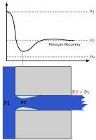
Figure 1: Injector element pressure history.

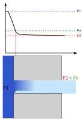

with high vapor pressure. This results in the formation of a significant amount of vapor, limiting the mass flow rate due to flow choking upstream of the injector. The figure also depicts the pressure profile for a fluid with low vapor pressure (left image), where the vena contracta is formed due to flow separation. The vena contracta may or may not contain vapor pockets, depending on the pressure near the sharp edges. When the downstream pressure falls below a critical value, given a certain upstream pressure, the mass flow rate reaches its maximum and the orifice becomes choked in

<!-- page 6 -->

terms of mass flow. This regime is known as critical flow, characterized by a mass flow rate that is independent of the downstream pressure.

Dyer et al. approach the non-equilibrium effects as a result of two processes: superheating of the saturated liquid during pressure drop and finite vapor bubble growth rates. The bubble growth time, $\tau_{b}$, is defined as:

$\tau_{b}=\sqrt{\frac{3}{2}\frac{\rho^{L}}{P_{v}-P_{2}}}$ (23)

The residence time of the liquid inside the injector $\tau_{r}$ is inversely proportional to the velocity of the flow and it is:

$\tau_{r}=\frac{L}{u}=L\frac{\rho^{L}}{2\Delta P}$ (24)

The non-equilibrium parameter $\kappa$ is obtained from the above definitions:

$\kappa=\frac{\tau_{b}}{\tau_{r}}=\sqrt{\frac{P_{1}-P_{2}}{P_{v}-P_{2}}}$ (25)

The model developed by Dyer et al. and refined by Solomon*[12]* takes into account a smooth transition between the predictions of the HEM and the Single Phase Incompressible (SPI) models. Solomon refers to this form of the Dyer model as the Generalized Non-Homogeneous Non-Equilibrium (NHNE) model. It can be expressed as:

$\dot{m}_{Dyer}=\left(\frac{\kappa}{1+\kappa}\dot{m}_{SPI}+\frac{1}{1+\kappa}\dot{m}_{HEM}\right)$ (26)

where $\dot{m}_{SPI}$ and $\dot{m}_{HEM}$ are given as described in section 2.1 and 2.3:

$\dot{m}_{SPI}=C_{d}A_{2}\sqrt{2\rho\Delta P}\qquad\dot{m}_{HEM}=C_{d}A\rho_{2}\sqrt{2(h_{1}-h_{2})}$ (27)

The model considers that when $\tau_{r}\ll\tau_{b}$, only a negligible amount of vapor is produced at the exit, and the single phase flow assumption is valid. Instead, when $\tau_{b}\ll\tau_{r}$ the flow rate approaches the value predicted by HEM.
It is important to note two main drawbacks of this model: the first one is that it cannot consider choked flow condition across the orifice without making additional corrections;*[13]* the second one is when considering a tank under equilibrium condition, the $\kappa$ parameter in Dyer model becomes equal to 1. This makes the coefficients multiplying the SPI and HEM mass flow rates simply equal to 0.5, thus totally canceling the non-equilibrium contribution across the orifice. However, variations in the drained phase can occur even if the self-pressurization model assumes equilibrium conditions. Specifically, it depends on both the orifice upstream conditions and the pressure jump across the orifice that makes slanting the balance more towards single-phase or two-phase contribution.

### 2.5 Foletti Magni La Luna

The above-mentioned drawbacks intrinsically related to the Dyer model are overcome by the FML (Foletti Magni & La Luna) model. The FML model introduces few modifications to the classical Dyer model to account for fluid compressibility and choked flow conditions:

$\dot{m}_{Dyer,comp}=\left(\left(1-\frac{1}{1+\kappa}\right)\dot{m}_{SPC}+\frac{1}{1+\kappa}\dot{m}_{HEM_{c}}\right)$ (28)

Furthermore, the authors proposed an alternative balance factor between the two contribution used by Dyer, to improve the overall accuracy of the prediction. Instead of the $\kappa$ parameter, they have used the orifice downstream void fraction, defined in function of the slip ratio and the downstream quality $x$. These two quantities are computed respectively by the expression suggested by Zivi*[11]* and from the isentropic assumption as done for the HEM mass flow rate model in section 2.3. For clarity, these quantities are provided below:

$S=\left(\frac{\rho_{2,liq}}{\rho_{2,sup}}\right)^{\frac{1}{3}}$ (29)

<!-- page 7 -->

$$
x _ {2} = \frac {s _ {1} - s _ {2 , l i q}}{s _ {2 , v a p} - s _ {2 , l i q}} \tag {30}
$$

The FML model aims to weigh the two contributions of the Dyer compressible model based on the downstream void fraction. This parameter appears to be more physically meaningful than both the  $\kappa$  factor and the static quality  $x$ , as it is a function of the density ratio:

$$
\dot {m} _ {F M L _ {l i q}} = \left(\left(1 - \alpha_ {2}\right) \cdot \dot {m} _ {S P C} + \alpha_ {2} \cdot \dot {m} _ {H E M _ {c}}\right) \tag {31}
$$

$$
\dot {m} _ {F M L _ {v a p}} = \left(\alpha_ {2} \cdot \dot {m} _ {S P C} + \left(1 - \alpha_ {2}\right) \cdot \dot {m} _ {H E M _ {c}}\right) \tag {32}
$$

where:

$$
\alpha_ {2} = \frac {1}{1 + \frac {1 - s _ {2}}{x _ {2}} S \frac {\rho_ {1 , v a p}}{\rho_ {2 , l i q}}} \tag {33}
$$

It is worth noting that the model is intrinsically constrained to the enforcement of the discharged phase deriving from the presence of two different expressions (one for liquid phase and one for vapor phase phase).

## 3. Proposed Model: Dual SPC

A new mass flow rate model, referred to Dual SPC model, has been proposed as an addition to the previously explained models. The aim of this new model is to improve the prediction accuracy of the mass flow rate and eliminate the need for a priori knowledge of the drained mass in the FML flow rate model.

The Dual SPC model is based on the concept that the fluid flux across the orifice can be approximated as the sum of two separate fluxes: one for the liquid phase and one for the vapor phase, flowing in two concentric tubes. It incorporates two mass flow rate models, considering the flow conditions of the single liquid phase in one channel and the gas phase in the other channel. The Dual SPC model utilizes the Single Phase Compressible and addresses the challenge of accurately distinguishing between the sections involving the liquid phase and the sections where only the gas phase flows.

The void fraction  $(\alpha)$  and the static quality  $(x)$  generic forms are as follows:

$$
\alpha = \frac {A _ {v a p}}{A _ {t o t}} \quad x = \frac {m _ {v a p}}{m _ {t o t}} \tag {34}
$$

Both of these quantities can be computed downstream of the orifice. The void fraction is related to  $x$  and the slip ratio, while the quality is calculated using the leverage rule as shown in Equation 33 and Equation 30 with both the  $\rho_{liq,vap}$  and  $s_{liq,vap}$  considered at downstream conditions, while  $s$  is the upstream specific entropy. The new mass flow rate model, depicted in Fig. 2, takes into account the most general configuration because the actual condition inside the tank cannot be known a priori. Therefore, the drained flow is always a mixture of liquid and bubbles or a combination of liquid and vapor.

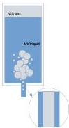
Figure 2: Dual SPC model physical design concept.

<!-- page 8 -->

The proposed solution considers two channels after the tank: one that contains only liquid and the other only vapor. Mass and heat transfer between these channels are not considered. As mentioned earlier, the flow rate inside each channel is described using a two-phase model, which is a combination of two Single Phase Compressible models tailored for the liquid and vapor channels, respectively. The models are weighted by the void fraction.

The equation describing the Dual SPC model can be expressed as follow:

$$
\begin{array}{l} \dot {m} _ {S P C _ {\text {s u m}}} = (\mathbf {1} - \alpha_ {\mathbf {A}}) \dot {\mathbf {m}} _ {\mathbf {S P C} _ {\mathbf {0} _ {\mathbf {0}}}} + \alpha_ {\mathbf {A}} \dot {\mathbf {m}} _ {\mathbf {S P C} _ {\text {v a p}}} + (\mathbf {1} - \alpha_ {\mathbf {B}}) \dot {\mathbf {m}} _ {\mathbf {S P C} _ {\mathbf {0} _ {\mathbf {0}}}} + \alpha_ {\mathbf {B}} \dot {\mathbf {m}} _ {\mathbf {S P C} _ {\text {v a p}}} = \\ = A _ {A} \left[ \left(1 - \alpha_ {A}\right) G _ {S P C _ {0 q}} + \alpha_ {A} G _ {S P C _ {v a p}} \right] + A _ {B} \left[ \left(1 - \alpha_ {B}\right) G _ {S P C _ {0 q}} + \alpha_ {B} G _ {S P C _ {v a p}} \right] \\ \end{array}
$$

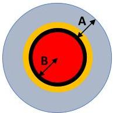
Figure 3: Dual SPC model area division.

liquid

evaporated liquid

vapor

condensed vapor

Figure 3 allows to understand the physical meaning of the quantities involved in the equation. The "only liquid" and "only vapor" channels, depicted as two-phase flows, experience cavitation and condensation within each channel. Thus, the presence of two different  $\alpha$  values and two different  $x$  values (one for the "only liquid" channel and one for the "only vapor" channel) is justified. Notably,  $\alpha_{A}$  represents the ratio between the evaporated liquid (indicated by the yellow ring) and the total area of the liquid channel (comprising yellow and blue rings), while  $\alpha_{B}$  denotes the ratio between the area of only vapor (indicated by the red circle) and the total area of the vapor channel (comprising the red circle and the black ring).

It is important to highlight that in the Dual SPC definition the  $\alpha$  values are computed downstream the orifice, and  $A_{A}$  and  $A_{B}$  are the total channel areas that have been assumed to remain constant for the entire draining duration:

$$
A _ {A} = A _ {A, l i q} + A _ {A, v a p} \quad A _ {B} = A _ {B, l i q} + A _ {B, v a p} \tag {35}
$$

# 4. Experimental Campaign

The experimental campaign was conducted at the end of 2022 to validate the proposed Dual SPC model. The experimental setup comprised a 10-liter draining tank, three pressure transmitters, a Coriolis mass flow meter, and a calibrated orifice with a diameter of  $1\mathrm{mm}$ . The feeding line diameter was  $1/4$ . Pressure transmitters were strategically positioned before and after the orifice, as well as on the nitrous tank, to monitor the vessel pressure. The discharge coefficient was assumed to be 0.7 based on the orifice geometry.[14] A Process and Instrumentation Diagram (P&amp;ID) illustrating the test setup for liquid drainings is provided in Figure 4.

<!-- page 9 -->

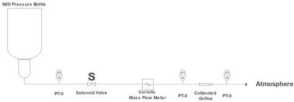
P&amp;ID Test Setup 1
Figure 4: Experimental setup diagram.

The second experimental setup was similar to the previous one, except that the bottle was not inverted. The decision to place the tank in an upside-down position for liquid discharge was necessary due to the absence of a dip tube in the employed bottles. During the experimental campaign, temperature measurements were initially obtained using a thermometer. However, for the subsequent numerical analysis, the temperature was computed at each time instant using CoolProp software. The density of the considered phase and the pressure measured by the pressure transmitters served as input parameters for the temperature calculation. A total of 19 drainings were performed, including 12 liquid drainings, 5 vapor drainings, 1 complete discharge of the remaining liquid inside the tank, and 1 complete gas discharge. The draining durations were set to 5 and 10 seconds.

# 4.1 Result and Comments

In the following section, a comparison between the above-mentioned mass flow models will be carried out in the context of the achieved experimental campaign. The figures have been categorized based on the drained phase into two sections: liquid drainings and vapor drainings. The liquid drainings are shown in Figures 5 to 16, while the vapor drainings are presented in Figures 17 to 21. The inclusion of additional models, not described in this paper, in the figures depicting liquid and vapor draining is justified by the need to provide a comprehensive overview of the available models in the field for comparison and future reference.

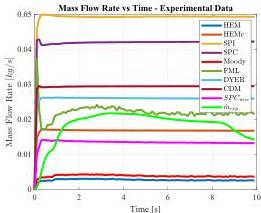
Figure 5: Liquid draining 1.

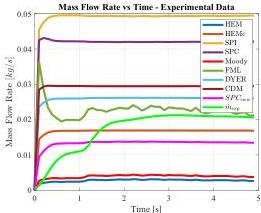
Figure 6: Liquid draining 2.

<!-- page 10 -->

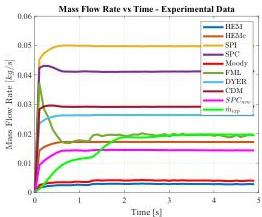
Figure 7: Liquid draining 3.

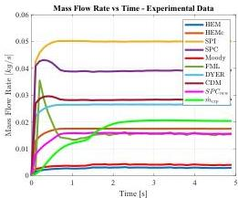
Figure 8: Liquid draining 4.

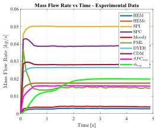
Figure 9: Liquid draining 5.

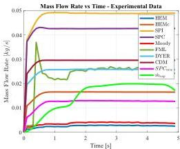
Figure 10: Liquid draining 6.

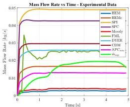
Figure 11: Liquid draining 7.

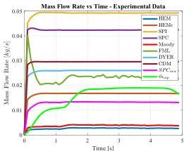
Figure 12: Liquid draining 8.

<!-- page 11 -->

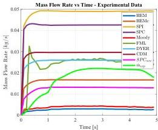
Figure 13: Liquid draining 9.

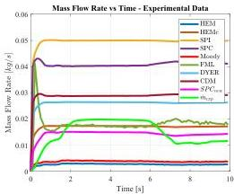
Figure 14: Liquid draining 10.

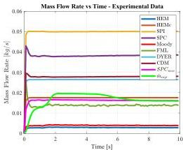
Figure 15: Liquid draining 11.

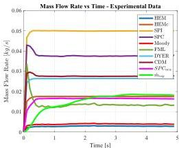
Figure 16: Liquid draining 12.

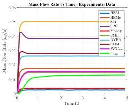
Figure 17: Vapor draining 1.

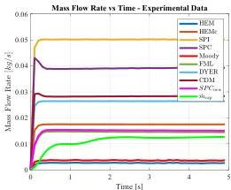
Figure 18: Vapor draining 2.

<!-- page 12 -->

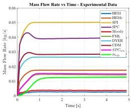
Figure 19: Vapor draining 3.

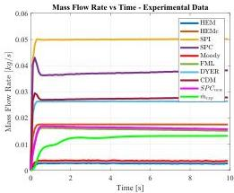
Figure 20: Vapor Draining 4.

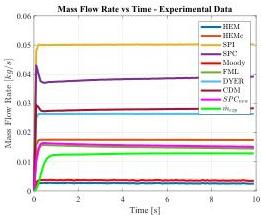
Figure 21: Vapor Draining 5.

To ensure consistency with the study conducted by La Luna et al.,[15] the FML model implemented in this research adopts a single criterion for the onset of the choking condition. Tables 2 and 3 summarize the results of the comparison, presenting the predicted mass flow rate by the models, the experimental mass flow rate, and the relative deviations for each test.

<!-- page 13 -->

Table 2: Mass flow rate models comparison - liquid experiments.

|   | Exp. [kg/s] | FML [kg/s] | Err. [%] | Dyer [kg/s] | Err. [%] | HEM [kg/s] | Err. [%] | D - SPCnew [kg/s] | Err. [%]  |
| --- | --- | --- | --- | --- | --- | --- | --- | --- | --- |
|  Test 1 | 0.018 | 0.022 | 19.621 | 0.026 | 40.926 | 0.017 | 8.844 | 0.013 | 26.994  |
|  Test 2 | 0.017 | 0.022 | 30.979 | 0.025 | 49.902 | 0.016 | 3.193 | 0.013 | 22.718  |
|  Test 3 | 0.016 | 0.019 | 23.102 | 0.026 | 62.148 | 0.017 | 5.543 | 0.014 | 12.690  |
|  Test 4 | 0.016 | 0.016 | 4.665 | 0.026 | 56.838 | 0.017 | 3.028 | 0.015 | 9.029  |
|  Test 5 | 0.016 | 0.015 | 6.098 | 0.026 | 58.875 | 0.017 | 4.753 | 0.015 | 5.971  |
|  Test 6 | 0.015 | 0.024 | 57.415 | 0.025 | 67.092 | 0.016 | 6.496 | 0.012 | 18.637  |
|  Test 7 | 0.015 | 0.023 | 56.996 | 0.025 | 69.005 | 0.016 | 8.132 | 0.012 | 16.818  |
|  Test 8 | 0.015 | 0.023 | 50.973 | 0.025 | 66.461 | 0.016 | 7.185 | 0.013 | 15.877  |
|  Test 9 | 0.017 | 0.024 | 37.665 | 0.025 | 45.922 | 0.016 | 6.597 | 0.013 | 27.569  |
|  Test 10 | 0.015 | 0.018 | 22.049 | 0.026 | 76.340 | 0.017 | 15.158 | 0.014 | 3.459  |
|  Test 11 | 0.016 | 0.014 | 16.495 | 0.026 | 58.928 | 0.017 | 5.314 | 0.016 | 2.661  |
|  Test 12 | 0.015 | 0.014 | 9.536 | 0.026 | 71.889 | 0.017 | 13.908 | 0.016 | 6.334  |
|  Mean |  |  | 29.642 |  | 59.313 |  | 6.749 |  | 14.766  |

Table 3: Mass flow rate models comparison - vapor experiments.

|   | Exp. [kg/s] | FML [kg/s] | Err. [%] | Dyer [kg/s] | Err. [%] | HEM [kg/s] | Err. [%] | D - SPCnew [kg/s] | Err. [%]  |
| --- | --- | --- | --- | --- | --- | --- | --- | --- | --- |
|  Test 1 | 0.012 | 0.014 | 23.748 | 0.026 | 123.373 | 0.017 | 47.753 | 0.015 | 28.859  |
|  Test 2 | 0.011 | 0.014 | 29.243 | 0.026 | 136.085 | 0.017 | 56.080 | 0.015 | 34.587  |
|  Test 3 | 0.011 | 0.013 | 22.668 | 0.025 | 133.296 | 0.017 | 52.889 | 0.014 | 27.787  |
|  Test 4 | 0.012 | 0.015 | 28.183 | 0.026 | 117.697 | 0.017 | 44.755 | 0.016 | 33.345  |
|  Test 5 | 0.012 | 0.015 | 21.152 | 0.026 | 113.715 | 0.017 | 41.779 | 0.015 | 26.109  |
|  Mean |  |  | 24.999 |  | 124.833 |  | 48.651 |  | 30.137  |

with

$$
E r r [ \% ] = a b s \left(\frac {M F R _ {\text {model}}}{M F R _ {\text {experimental}}} - 1\right) \cdot 100 \tag{36}
$$

Upon analyzing the obtained numerical results, it becomes evident that, in general, no model is capable of capturing the transient variations in mass flow rate. However, most models exhibit accurate predictions of the overall behavior of the drained mass flow rate. Focusing on the liquid tests, it is observed that the HEM model exhibits the lowest relative deviation, followed by the Dual SPC and FML models. On the other hand, for the vapor drainings, the FML demonstrates the lowest average error, followed by the Dual SPC.

# 5. Conclusion

In this paper we have presented an analysis of various models used for predicting mass flow rates in draining tanks. Analyzing the results, we have identified the strengths and limitations of these models. While none of the models were capable of accurately capturing transient variations in mass flow rate, most of them exhibited good performance in predicting the overall behavior of drained mass flow rates.

It is important to highlight that the Dual SPC model offers a robust methodology that validates the FML mass flow rate equations and is not constrained by preconceived ideas about the discharged phase. The significance of the Dual SPC model lies in its applicability to microgravity conditions. In such scenarios, the assumption of a tank draining condition, which is necessary for correctly implementing one of the two FML formulas, is a significant limitation. At the same time, the Dual SPC model enables the consideration of a more general tank configuration, where the state inside is unspecified, therefore, shifting the problem to channel surface modeling. As a future step, this issue can be addressed through the development of a self-pressurization model that accurately reflects the microgravity phenomenon.

<!-- page 14 -->

# References

[1] A. E. Nosseir A. Cervone and A. Pasini. Review of state-of-the-art green monopropellants: For propulsion systems analysts and designers. *Aerospace*, 2021.

[2] B. S. Waxman. An investigation of injectors for use with high vapor pressure propellants with applications to hybrid rockets. *PhD thesis. Palo Alto, California: Stanford University*, 2014.

[3] E. Vargas Nino and M. R. H. Razavi. Design of two-phase injectors using analytical and numerical methods with application to hybrid rockets. *AIAA Propulsion and Energy*, 2019.

[4] T. L. Sokolowski and T. Kozlowski. Assessment of two-phase critical flow models performance in relap5 and trace against marviken critical flow tests. *Office of Nuclear Regulatory Research, US Nuclear Regulatory Commission*, 2012.

[5] G. Zilliac, B. S. Waxman, B. Cantwell and J. E. Zimmerman. Mass flow rate and isolation characteristics of injectors for use with self-pressurizing oxidizers in hybrid rockets. *49th AIAA/ASME/SAE/ASEE Joint Propulsion Conference*, page 3636, 2013.

[6] B. Cantwell, J. Zimmerman and G. Zilliac. Initial experimental investigations of self-pressurizing propellant dynamics. *48th AIAA/ASME/SAE/ASEE Joint Propulsion Conference Exhibit*, page 4198, 2012.

[7] K. C. Cornelius and K. Srinivas. Isentropic compressible flow for non-ideal gas models for a venturi. *J. Fluids Eng.*, page 238–244, 2004.

[8] G. P. Celata, G. Boccardi, R. Bubbico and B. Mazzarotta. Two-phase flow through pressure safety valves: experimental investigation and model prediction. *Chemical Engineering Science*.

[9] A. Sadhwani, A. Karabeyoglu, J. Dyer, G. Zilliac and B. Cantwell. Modeling feed system flow physics for self-pressurizing propellants. *43rd AIAA/ASME/SAE/ASEE Joint Propulsion Conference Exhibit*, page 5702, 2007.

[10] G. B. Wallis. One-dimensional two-phase flow. *Courier Dover Publications*, 2020.

[11] S. Zivi. Estimation of steady-state steam void-fraction by means of the principle of minimum entropy production.

[12] B. J. Solomon. Engineering model to calculate mass flow rate of a two-phase saturated fluid through an injector orifice.

[13] B. Cantwell, J. E. Zimmerman, B. S. Waxman and G. Zilliac. Initial experimental investigations of self-pressurizing propellant dynamics. *49th AIAA/ASME/SAE/ASEE Joint Propulsion Conference*.

[14] G. P. Sutton and O. Biblarz. Rocket propulsion elements. *John Wiley Sons*.

[15] S. La Luna et al. Two-phase mass flow rate model for nitrous oxide based on void fraction. *Aerospace*, 2022.