# Flow-Pattern Identification and Pressure-Drop Measurement in a Self-pressurized Flow of Nitrous Oxide*

Takuya TADA, $^{1)}$  Kazuki YASUDA, $^{2)}$  Hiro OKANO, $^{1)}$  Hikaru EGUCHI, $^{2)}$  Masaharu UCHIUMI, $^{2)}$  and Daisuke NAKATA $^{2)}$ †

$^{1)}$ Division of Production Systems Engineering, Muroran Institute of Technology, Muroran, Hokkaido 050-8585, Japan

$^{2)}$ Aerospace Plane Research Center, Muroran Institute of Technology, Muroran, Hokkaido 050-8585, Japan

This paper discusses the flow characteristics of nitrous oxide, which is widely used as a self-pressurizing oxidant in small rocket engines, especially focusing on a pressure drop model. In a feed line with a tank pressure of  $2.5 - 5.0\mathrm{MPa}$ , a flow rate of  $200 - 550\mathrm{g / s}$ , and a pipe inner diameter of  $10\mathrm{mm}$ , the pipe pressure drop was measured using a differential pressure gauge, the void fraction was measured using a capacitance meter, and visualization was performed using a high-speed camera. From the image obtained with a high-speed camera, many fine bubbles of a diameter of about  $100 - 200\mu \mathrm{m}$  were observed in our test cases, resulting in a flow classified as a bubble flow. It was clarified that Dukler's formula can predict the pressure drop within the mean absolute error of  $15\%$ .

Key Words: Nitrous Oxide, Pressure Drop, Two-Phase Flow, Void Fraction

# Nomenclature

$A$  : cross sectional area

$C_d$ : discharge coefficient

$C_{\mu}$ : correction factor

$d$ : pipe inner diameter

$G$  : mass flux

$j$ : superficial velocity

$L$ : pipe length

MAE: Mean Absolute Error

ME: Mean Error

$m$  : mass flow rate

$N$ : total number of experimental data

$P$ : pressure

$\Delta P$ : frictional pressure drop

$P_{f}$ : reduced pressure

$Q$ : volumetric flow rate

$Re$ : Reynolds number

$t$ : time

$u$ : flow velocity

$W_{flow}$ : total discharged oxidizer mass

$x$ : quality

$\alpha$  : void fraction

$\lambda$ : pipe friction coefficient

$A$ : corrected coefficient of Baker

$\mu$ : viscosity

$\rho$ : density

$\sigma$ : surface tension

$\Psi$ : corrected coefficient of Baker

# Subscripts

air: air

$c$ : combustion chamber

cal: calculated value

end: discharge end time

expt: experimental value

$G$  : gas phase

ini: discharge initial time

inj: injector

$L$ : liquid phase

line: flow path

$o$ : oxidizer

sat: saturation

TP: gas-liquid two-phase

water: water

# 1. Introduction

Nitrous oxide  $(\mathrm{N}_2\mathrm{O})$  can be self-pressurized with a vapor pressure and it is widely used as oxidizer in small flight missions, including the manned spacecraft SpaceShipOne. $^{1-5)}$

However, in a self-pressurizing supply system, the propellant in the tank is already in a state of gas-liquid equilibrium, and accurate prediction of the two-phase flow pressure drop in the supply pipe is an ongoing technical issue.

The pressure drop of gas-liquid two-phase flow has been discussed for a long time. In case of nitrous oxide, which has a high vapor pressure, there are few examples of experimental research, and the flow pattern has not been clarified. In determining the pressure-drop model, the void fraction is an important factor. The following are some of the few examples of prior research on  $\mathrm{N}_2\mathrm{O}$  flow, including the discussion of void fraction. Luna et al. theoretically modeled the flow rate of nitrous oxide from the tank when the void fraction was given. Also, Yasuda et al. proposed a model for esti

<!-- page 2 -->

mating the void fraction of nitrous oxide based on the results of their experiment and found that the void fraction increases in a downstream direction. $^{8)}$ With reference to these methods, this study focuses on pipe diameter $(1/2^{\prime\prime})$, pipe length (400 or $800\mathrm{mm}$), and flow rate $(200 - 550\mathrm{g / s})$ commonly found in hybrid engines for model rockets. Additionally, the identification of the flow pattern by the visualization pipe, void fraction measurement, and pressure drop measurement were performed at the same time, and the relationship between them is discussed.

# 2. Theory

## 2.1. Description of flow patterns in horizontal pipes

Gas-liquid two-phase flow exhibits various flow aspects depending on the physical properties of fluids, channel shape of pipes. $^{9)}$ Figure 1 shows eight flow patterns in a horizontal pipe. Figure 1 (1) shows bubbly flow. In bubbly flow, many small bubbles are dispersed in the liquid phase, sometimes in the upper part of the pipe due to buoyancy. When the flow becomes dominated by shear force under high-mass conditions, many small bubbles are dispersed uniformly in the pipe. $^{10)}$ Figure 1 (2) shows plug flow. In plug flow, small, elongated bubbles flow in the upper part of the pipe. Figure 1 (3) shows slug flow. In slug flow, intermittent bubbles with a diameter of more than half of the inner diameter of the pipe are observed. Figure 1 (4) shows stratified flow. Stratified flow is often seen when the gas-liquid velocity is slow, and the flow is separated into an upper gas phase and a lower liquid phase. When the gas-phase velocity increases, the gas-liquid interface becomes a stratified-wavy flow in Fig. 1 (5) due to its shear force. Figure 1 (6) shows annular flow. In annular flow, the inner wall of the pipe is covered with a liquid film, and the gas phase flows through the center of the pipe. This is seen in flows with higher gas-phase velocity than in stratified-wavy flow. Figure 1 (7) shows annular-dispersed

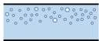
(1) Bubbly flow

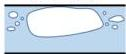
(3) Slug flow

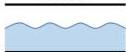
(5) Stratified-wavy flow

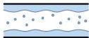
(7) Annular-dispersed flow

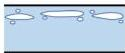
(2) Plug flow

(4) Stratified flow

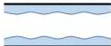
(6) Annular flow

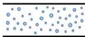
(8) Mist flow

flow. In annular-dispersed flow, droplets in the gas phase are contained at the center of the pipe. Figure 1 (8) shows mist flow. In mist flow, droplets are dispersed in the pipe, which is seen when the gas-phase flow velocity is greater than that of the stratified-annular flow.

In this manner, the distribution of the gas phase and liquid flow varies widely, affecting pressure-drop characteristics. $^{11,12)}$ Therefore, it is important to identify the pattern of gas-liquid two-phase flow through visualization experiments.

## 2.2. Flow pattern maps

There are two ways to identify the flow pattern: experimental visualization and analogy using flow-pattern maps representative of physical quantities. Figure 2 shows the flow-pattern map proposed by Baker. The Baker's flow-pattern map is well known as a flow pattern for an adiabatic horizontal pipe, and was created based on experimental data for water-air two-phase flow but can be applied to other fluids if two terms are corrected. $^{13)}$ The horizontal and vertical axes in Fig. 2 are expressed as follows using gas phase mass flux $G_{G}$, liquid phase mass flux $G_{L}$, and corrected coefficients $\Lambda$ and $\Psi$.

$$
\text{horizontal axis:} \quad \left(\frac {G _ {L}}{G _ {G}}\right) \Lambda \Psi
$$

$$
\text{vertical axis:} \quad \frac {G _ {G}}{\Lambda}
$$

$\Lambda$ and $\Psi$ of the working fluid are described as follows using gas phase density $\rho_{G}$, liquid phase density $\rho_{L}$, surface tension $\sigma$ and liquid phase viscosity $\mu_{L}$, relative to those of water or air.

$$
\Lambda = \left(\frac {\rho_ {G}}{\rho_ {\text {air}}} \frac {\rho_ {L}}{\rho_ {\text {water}}}\right) ^ {\frac {1}{2}} \tag {1}
$$

$$
\Psi = \left(\frac {\sigma_ {\text {water}}}{\sigma}\right) \left[ \left(\frac {\mu_ {L}}{\mu_ {\text {water}}}\right) \left(\frac {\rho_ {\text {water}}}{\rho_ {L}}\right) ^ {2} \right] ^ {\frac {1}{2}} \tag {2}
$$

where

$$
\rho_ {\text {water}} = 1 0 0 0 \mathrm {k g} / \mathrm {m} ^ {3}
$$

$$
\rho_ {\text {air}} = 1. 2 3 \mathrm {k g} / \mathrm {m} ^ {3}
$$

$$
\mu_ {\text {water}} = 0. 0 0 1 \mathrm {P a} \cdot \mathrm {s}
$$

$$
\sigma_ {\text {water}} = 0. 0 7 2 \mathrm {N} / \mathrm {m}
$$

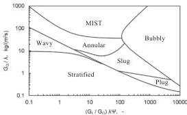
Fig. 1. Flow patterns in horizontal flow.
Fig. 2. Baker's flow-pattern map for horizontal flow. $^{9,14)}$

<!-- page 3 -->

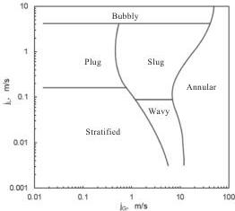
Fig. 3. Mandhane's flow-pattern map for horizontal flow. $^{(5,16)}$

known as a flow pattern for a horizontal pipe and was created based on experimental data for water/air at normal temperature and pressure. The horizontal axis of the Mandhane's flow-pattern map is the gas phase apparent velocity $j_{G}$, and the vertical axis is the liquid phase apparent velocity $j_{L}$. Here, apparent velocity is defined as the volumetric flow rate per unit area using the following formula.

$$
j_{G} = \frac{\dot{Q}_{G}}{A_{line}} \tag{3}
$$

$$
j_{L} = \frac{\dot{Q}_{L}}{A_{line}} \tag{4}
$$

The apparent velocity is expressed by the following equation using the void fraction $\alpha$ and the actual velocities $u_{G}$ and $u_{L}$ of each phase.

$$
j_{G} = \alpha u_{G} \tag{5}
$$

$$
j_{L} = (1 - \alpha) u_{L} \tag{6}
$$

Note that we investigated many other diagrams but specifically chose Baker's and Mandhane's maps as the most promising ones because the background condition (adiabatic condition, range of apparent velocity) are close to our test cases.

## 2.3. Pressure-drop model

### 2.3.1. Single-phase frictional pressure-drop model

The frictional pressure drop of a straight pipe in a single-phase flow can be calculated using the Darcy-Weisbach equation.

$$
\Delta P = \lambda \frac{L}{d} \frac{1}{2} \rho_{L} u_{L}^{2} \tag{7}
$$

The pipe friction coefficient $\lambda$ is expressed by the following Nikradze equation at $Re &gt; 10^{5}$.

$$
\lambda = 0.0032 + 0.221 R e^{-0.237} \tag{8}
$$

$$
R e = \frac{\rho_{L} u_{L} d}{\mu_{L}} \tag{9}
$$

### 2.3.2. Two-phase frictional pressure drop model

Here, we describe the frictional pressure drop of a homogeneous-flow model, which is one of the flow models for gas-liquid two-phase flow. In this self-pressurizing system, the working fluid in the pipe is at a condition of equilibrium, so unless otherwise specified, the physical properties of the fluid are assumed to be in a saturated state. The homogeneous-flow model assumes that the gas-liquid is sufficiently mixed and the gas-liquid velocity is equal. Therefore, a gas-liquid two-phase flow can be treated as a single-phase fluid. The homogeneous-flow model has a very large mass flux and is suitable for bubbly or mist flows.[17] In a homogeneous flow model, a frictional pressure drop in a straight pipe can be obtained using the Darcy-Weisbach equation, similar to the case of a single-phase flow.

$$
\Delta P = \lambda_{TP} \frac{L}{d} \frac{1}{2} \rho_{TP} u_{TP}^{2} \tag{10}
$$

The two-phase flow average density $\rho_{TP}$ is expressed by the following equation using void fraction $\alpha$.

$$
\rho_{TP} = \alpha \rho_{G} + (1 - \alpha) \rho_{L} \tag{11}
$$

$$
u_{TP} = \frac{\dot{m}_{o}}{\rho_{TP} A_{line}} \tag{12}
$$

Here, the mass flow rate $\dot{m}_{o}$ is expressed by Eq. (13) using the discharge coefficient $C_{d}$, the cross-sectional area of injector $A_{inj}$, the saturated liquid phase density $\rho_{Lsat}$, the injector pressure $P_{inj}$, and the combustion chamber pressure $P_{c}$.

$$
\dot{m}_{o} = C_{d} A_{inj} \sqrt{2 \rho_{Lsat} (P_{inj} - P_{c})} \tag{13}
$$

During the flow test, we assume that $C_d$ is constant and this is determined by Eq. (14). The tank weight is always monitored during the flow test, and we can determine the total discharged oxidizer mass $W_{flow}$ by the difference between the initial tank weight and final tank weight. The detailed procedure and error analysis is described in Ref. 8), and here we note that the error of the mass flow rate is less than $0.01\,\mathrm{kg/s}$ and the resulting error of $u_{TP}$ is $2\%$ of the calculated value.

$$
C_{d} = \frac{W_{flow}}{\int_{t_{ex}}^{t_{end}} A_{inj} \sqrt{2 \rho_{Lsat} (P_{inj} - P_{c})} dt} \tag{14}
$$

The two-phase pipe friction coefficient $\lambda_{TP}$ is expressed by the following Nikradze equation at $Re &gt; 10^{5}$.

$$
\lambda_{TP} = 0.0032 + 0.221 R e_{TP}^{-0.237} \tag{15}
$$

$$
R e_{TP} = \frac{\rho_{TP} u_{TP} d}{\mu_{TP}} \tag{16}
$$

Various formulas have been proposed for the two-phase viscosity coefficient $\mu_{TP}$, and we examine the applicability of the three formulas shown in Table 1.

Owens' equation focuses on the fact that the liquid phase is in contact with the wall surface in many flow patterns and assumes that a frictional pressure drop is predominantly due

<!-- page 4 -->

Table 1. Two-phase viscosity.

|  ① Owens(8) | μTP = μL  |
| --- | --- |
|  ② Dukler et al.(9) | μTP = αμG + (1 - α)μL  |
|  ③ Ducoulombier et al.(10) | μTP = xμG + (1 - x)CμL Cμ = -9.178Pt + 6.195  |

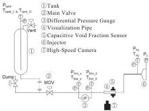
Fig. 4. Pipes and instrumentation diagram.

to the liquid's viscosity. Therefore, the two-phase viscosity coefficient is defined as being equal to the liquid-phase viscosity coefficient.

Dukler et al.'s formula defines the two-phase viscosity coefficient as the average value of the viscosity coefficients of the gas and liquid phases at a given void fraction.

Ducoulombier et al.'s equation is a two-phase viscosity coefficient constructed in a microchannel under adiabatic conditions for  $\mathrm{CO}_{2}$  two-phase flows. The equation of Cicchitti et al. $^{18)}$  has been modified to fit the experimental data with the second term having been multiplied by a correction factor  $C_{\mu}$  as a function of the reduced pressure  $P_{r}$ . Here,  $x$  is called quality, which is one of the important terms in gas-liquid two-phase flow and is defined as the ratio of the mass flow rate of gas phase to the total mass flow rate. The quality  $x$  is expressed by the following equation:

$$
x = \frac {\dot {m} _ {G}}{\dot {m} _ {G} + \dot {m} _ {L}} = \frac {\alpha \rho_ {G} u _ {G}}{\alpha \rho_ {G} u _ {G} + (1 - \alpha) \rho_ {L} u _ {L}} \tag {17}
$$

As this study assumed the homogeneous flow model, the gas and liquid velocity are equal and the quality  $x$  is calculated by the following equation:

$$
x = \frac {\alpha \rho_ {G}}{\alpha \rho_ {G} + (1 - \alpha) \rho_ {L}} \tag {18}
$$

# 3. Experimental Setup and Procedure

Figure 4 shows a piping diagram. Nitrous oxide or carbon dioxide was used as a working fluid. Carbon dioxide is as good simulant of nitrous oxide because carbon dioxide has similar thermophysical properties to nitrous oxide and is available at low costs.[21,22] We conducted a total of 29 flow tests, 7 of which were performed with  $\mathrm{N}_2\mathrm{O}$  and the rest were performed with  $\mathrm{CO}_{2}$ .

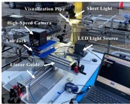
Fig. 5. Visualization measurement setup.

The oxidizer filled the tank flows through the pipe and is then discharged from injector for four seconds. The frictional pressure drop of the straight pipe is measured with a differential pressure gauge (KYOWA PDU-A-50KP). The measurement error of this differential pressure gauge was  $\pm 0.5\mathrm{kPa}$ . The length of the straight pipe is  $400\mathrm{mm}$  or  $800\mathrm{mm}$ , and the inner diameter of the straight pipe is  $9.14\mathrm{mm}$ . (The inner diameter is the average value of four diameters  $45^{\circ}$  apart measured with a digital caliper.) The length of the lead-in section is  $1000\mathrm{mm}$  or more. The visualization pipe is made of polycarbonate with an inner diameter of  $10\mathrm{mm}$ . The outer surface is  $16\mathrm{mm}$  square. The void fraction was measured with a capacitive void fraction sensor developed in our previous study.[23]

A high-speed camera was set up in front of the visualization pipe. An overview of the test equipment with a high-speed camera is shown in Fig. 5.

The high-speed camera used in this study is FATSCAM Mini AX100 (Photron). An AI AF Micro-Nikkor  $200\mathrm{mm}$  f/4D IF-ED (Nikon) was also used, and a teleconverter (Teleplus HD pro 2X DGX Nikon N-AF) was mounted to the main lens to double the focal distance of main lens.

The light source was UFLS-751-08W-UT (U-TECHNOLOGY), bolstered by a light sheet, UKG50-1500S (U-TECHNOLOGY), and a condenser lens, ULK-50 (U-TECHNOLOGY). The light sheet thickness was  $2\mathrm{mm}$  at a distance of  $50\mathrm{mm}$ . Linear guides and a lab jack were used to adjust the focus of the high-speed camera.

Figure 6 shows the layout of visualization measurement equipment. The focus of the high-speed camera was adjusted at the inner wall of the flow path and the upper part of the visualization pipe. The bubbles in the center core flow could not be depicted well due to very high foam density. The depth of field (the in-focus range of the depth direction) was about  $3\mathrm{mm}$ . Additionally, the shooting distance (i.e., the distance between the subject and the image sensor of the camera) was set to about  $500\mathrm{mm}$ . The light sheet was hung from the top of the visualization pipe, and the scattered light illuminated the bubbles near the wall. This backlight method is effective for taking a clear photograph of the bubble edge.[24]

<!-- page 5 -->

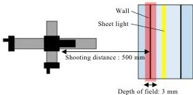
Fig. 6. Layout of visualization measurement.

Table 2. High-speed camera settings.

|  Resolution | 384 × 384 pixel  |
| --- | --- |
|  Frame rate | 21600 fps  |
|  Shutter speed | 1/250000 s  |
|  F-value | 32  |
|  Pixel size | 9.8 μm/pixel  |

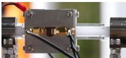
Fig. 7. Depiction by digital camera.

Directly illuminating the backlight from the opposite side of the pipe did not work well because the light was blocked by many bubbles.

The high-speed camera settings are shown in Table 2. A shutter speed of about  $1/250000$  seconds is required to take a sharp image of moving bubbles, and a frame rate of 21600 frame per seconds was required to track the moving bubbles. The resolution was chosen as a compromise of the requirements of other parameters.

# 4. Results and Discussion

# 4.1. Flow-pattern observations

A photograph of the visualization pipe taken during the test with the digital camera is shown in Fig. 7. The milky gas-liquid two-phase flow is observed in a self-pressurized flow. Generally, a diameter of  $1 - 100\mu \mathrm{m}$  of the bubbles is deemed a microbubble. It is known that a liquid containing many microbubbles develops a milky color due to microbubbles scattering light.[25,26] Serizawa et al. named a milky gas-liquid two-phase flow a milky bubbly flow.[27]

A photograph taken with a high-speed camera is shown in Fig. 8. The range of view of the photograph is  $3.8 \times 3.8 \mathrm{~mm}$ . The bubble diameter inside the red and green frames is respectively about  $200\mu \mathrm{m}$  and  $100\mu \mathrm{m}$ . Many fine bubbles with comparable diameters were observed in the image.

Note that the image shown in Fig. 8 is one of the clearest

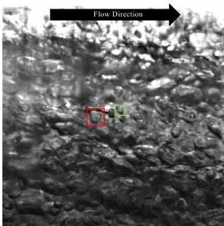
Fig. 8. Visualization by high-speed camera.

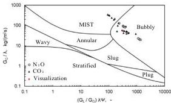
Fig. 9. Comparison with Baker's flow-pattern map.

in the series of flow tests, but similar patterns were observed in other test cases.

# 4.2. Comparison with flow-pattern maps

In the preceding section, the flow pattern was identified from the observation results of the visualization image. In this section, the flow pattern is quantitatively identified using flow-pattern maps. The comparison between the experimental values and Baker's flow-pattern map is shown in Fig. 9. The red plot corresponds to the high-speed camera imaging in Fig. 8. In this chart, about  $80\%$  of the total experimental data were classified as bubbly flow with the remaining  $20\%$  classified as mist flow area. However, we obtained the image in Fig. 8 even in cases belonging to the mist flow area. Generally, the boundaries in the flow-pattern maps are not strict and it is also possible that the flow occurred during the process of transition from bubble flow to mist flow in our test cases, as reported in Ref. 28). What we would like to discuss in this paper is not to strictly clarify the flow pattern in a wide range of regions, but rather to state the fact that the  $\mathrm{N}_2\mathrm{O}$  flow used in the feedline of self-pressurizing small rocket engines is typically considered to be bubble flow.

<!-- page 6 -->

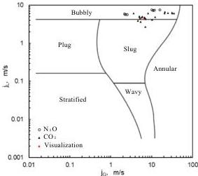
Fig. 10. Comparison with Mandhane's flow pattern map.

The data using $\mathrm{CO}_{2}$ and the data using $\mathrm{N}_2\mathrm{O}$ are distinguished on the graph, and the conclusion is that there is no clear difference between $\mathrm{N}_2\mathrm{O}$ and $\mathrm{CO}_{2}$. As has been said in the other references,[21,22] we verified that $\mathrm{CO}_{2}$ acts as a good simulant for $\mathrm{N}_2\mathrm{O}$.

Next, a comparison with Mandhane's flow-pattern map is described. A gas-liquid superficial velocity at each experimental value was obtained by assuming homogeneous model. Specifically, the gas and liquid velocity are equal to the two-phase flow average velocity as seen in the following equation.

$$
u_{TP} = u_{G} = u_{L} \tag{19}
$$

Therefore, a gas-liquid superficial velocity of Eq. (5) and Eq. (6) was calculated using the following equation.

$$
j_{G} = \alpha u_{TP} \tag{20}
$$

$$
j_{L} = (1 - \alpha) u_{TP} \tag{21}
$$

The results of comparison between Mandhane's flow pattern map and each experimental value are shown in Fig. 10. After these calculations, about $90\%$ of the total experimental data were classified as bubbly flow, while the remaining $10\%$ was classified as slug flow. Slug flow is a flow in which bubbles with a diameter of more than half of the pipe inner diameter appear intermittently. However, no such bubbles appear in the visual images.

## 4.3. Comparison with three existing two-phase pressure drop model

From the results of the preceding section, the overall flow pattern is considered to be bubbly flow, so a frictional pressure drop in the straight pipe is assumed given the homogeneous flow model. By comparing the experimental and calculated values of the frictional pressure drop obtained from three two-phase viscosity coefficients, the applicability of each two-phase viscosity coefficient was evaluated.

Comparisons between the experimental and calculated values are shown in Table 3. The mean error and the mean absolute error were defined using the following equations.

Table 3. ME and MAE of prediction formulas.

|  Authors | N = 28  |   |   |
| --- | --- | --- | --- |
|   |  ME | MAE | ξ15  |
|  ① Owens | 18.9% | 21.3% | 42.9%  |
|  ② Dukler et al. | 3.7% | 12.3% | 71.4%  |
|  ③ Ducoulombier et al. | 41.4% | 42.0% | 7.1%  |

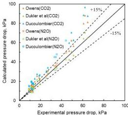
Fig. 11. Experimental pressure drop versus calculated pressure drop.

$$
ME = \frac{1}{N} \sum_{i=1}^{N} \left( \frac{\Delta P_{cal,i} - \Delta P_{expt,i}}{\Delta P_{expt,i}} \right) \times 100 \tag{22}
$$

$$
MAE = \frac{1}{N} \sum_{i=1}^{N} \left| \frac{\Delta P_{cal,i} - \Delta P_{expt,i}}{\Delta P_{expt,i}} \right| \times 100 \tag{23}
$$

Additionally, each experimental and calculated value is the average value of 2–4 seconds when the measurement data of the differential pressure gauge reached a steady state. Furthermore, $\xi_{15}$ presents the proportion of the number of data points within a margin of error of $15\%$. A comparison between the experimental and calculated values of the frictional pressure drop is shown in Fig. 11.

The MAE was about $21\%$ with the Owens's model. The calculated results tend to overestimate the pressure drop because the two-phase viscosity coefficient is represented by the liquid-phase viscosity coefficient in this scheme.

The MAE was about $12\%$, and $\xi_{15}$ was about $70\%$ with the Dukler's model. This model is considered to be the best of the three formulas. Averaging the physical quantities of two phases using the void fraction is an appropriate approximation method for bubbly flows in which fine bubbles are homogeneously contained.

The MAE was about $42\%$ using Ducoulombier's model. This model also overestimated the pressure drop because this viscosity coefficient was determined by the empirical results of the micro-channel experiments where the effect of viscosity is enhanced.

Therefore, given the homogeneous-flow model, we concluded that Dukler's two-phase viscosity coefficient predicts the frictional pressure drop of the flow field accurately.

<!-- page 7 -->

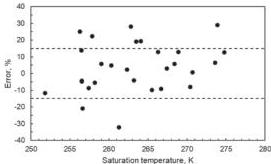
Fig. 12. Mean error for saturation temperature.

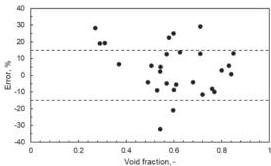
Fig. 13. Mean error for void fraction.

## 4.4. Effect of parameters on the estimation error of the pressure drop

Using Dukler's model, the effect of the saturation temperature and void fraction on the estimation error of the pressure drop is discussed. The scatter plot of errors against the saturation temperature is shown in Fig. 12.

Generally speaking, lower saturation temperatures increase the difference between gas and liquid saturation densities, resulting the larger slip ratio. Consequently, the application of the homogeneous model leads to underestimating the pressure drop.²⁹) However, in this study, there was no tendency to underestimate at lower saturation temperatures. It is thought that the difference in gas-liquid density had little effect on the slip ratio because the flow pattern was a bubbly flow. Therefore, this has no effect on the error in the saturation temperature at a range of 250–275 K.

The scatter plot of errors of the void fraction is shown in Fig. 13. In the void fraction range of 0.45–0.85, there was no obvious effect on errors. The void fraction is an important parameter because it characterizes flow patterns;³⁰) however, the flow pattern in this range of void fraction was always a bubbly flow. Therefore, Dukler's two-phase viscosity coefficient could predict the frictional pressure drop in the wide range of the void fraction. Conversely, in the void fraction of 0.3 or below, there was a tendency towards overestimation in over 20% of the errors. Further studies are needed because there are very few data points in the range of the void fraction of 0.3 or below.

## 5. Conclusion

In this study, the identification of flow patterns in the self-pressurization flow and the applicability of the existing prediction formula to the frictional-pressure drop in the straight pipe was discussed. Our test cases were in the range of a saturation temperature of 250–275 K, with a void fraction of 0.25–0.85, which is considered to be typical parameters in the feedline of self-pressurizing small rocket engines. We conducted totally 29 flow tests, 7 of which were performed with N₂O and the rest was performed with CO₂ as a good simulant. As has been said, no obvious difference was found between them. In comparison with the conventional flow-pattern map, more than 80% of our test data were classified as bubbly flow. From the image obtained with a high-speed camera, many fine bubbles of a diameter of about 100–200 μm were observed in our test cases, resulting in a flow classified as a bubble flow. In comparison with some conventional prediction formulas, it was found that Dukler's model is useful to predict the pressure drop within the mean absolute error of 15%. Also, it was verified that the void fraction and saturation temperature of the flow does not affect the mean error of pressure drop. These results could be helpful for designing a self-pressurizing supply system in small-flight missions.

## Acknowledgments

This work was supported by JSPS KAKENHI Grant Number 18K04555. Besides, the authors would like to express deep thanks to Associate Professor Yoshihiko Oishi at Muroran Institute of Technology, for his invaluable advice on the visualization of gas-liquid two-phase flow.

## References

1) SpaceShipOne: https://en.wikipedia.org/wiki/SpaceShipOne (retrieved on 20th Mar., 2023).
2) Kobald, M., Schmierer, C., Fischer, U., Tomilin, K., and Petrarolo, A.: A Record Flight of the Hybrid Sounding Rocket HEROS 3, Trans. JSASS Aerospace Tech. Japan, 16 (2018), pp. 312–317.
3) Shoyama, T., Wada, Y., and Matsui, T.: Conceptual Study on Low-Melting-Point Thermoplastic Fuel/Nitrous Oxide Hybrid Rockoon, J. Spacecrafts Rockets, 59, 1 (2022), pp. 286–294.
4) Tokudome, S., Yagishita, T., Goto, K., Suzuki, N., Yamamoto, T., and Daimoh, Y.: An Experimental Study of an N₂O/Ethanol Propulsion System with 2 kN Thrust Class BBM, Trans. JSASS Aerospace Tech. Japan, 19 (2021), pp. 186–192.
5) Ishihara, K., Sato, T., Nakata, K., Kimura, T., Nakajima, K., Suzuki, Y., Itouyama, N., Matsuoka, K., Kasahara, J., Kawasaki, A., Eguchi, H., Nakata, D., Uchiumi, M., Matsuo, A., Funaki, I., Kawashima, H., and Kojima, M.: Experimental Study on Thrust Performance of Cylindrical Rotating Detonation Rocket Engine with Liquid Ethanol – Liquid Nitrous Oxide, The 11th Asian Joint Conference on Propulsion and Power, Kanazawa, Mar. 15–18, 2023, AJCPP2023-086.
6) Hetsroni, G.: Handbook of Multiphase Systems, McGraw Hill Book Company, New York, 1982.
7) La Luna, S., Foletti, N., Magni, L., Zuin, D., and Maggi, F.: A Two-Phase Mass Flow Rate Model for Nitrous Oxide Based on Void Fraction, Aerospace, 9, 12 (2022), 828.
8) Yasuda, K., Nakata, D., and Uchiumi, M.: Experimental Study on Temperature Change by Cavitation Accompanying Self-Pressurization

<!-- page 8 -->

of Propellant for Small Rocket Engines, J. Fluid Eng., 143, 12 (2021), 121103.

9) Sakamoto, Y.: Experimental Study on Flow Regime and Heat Transfer Characteristics of Hydrogen Two-phase Flow Applying the Capacitive Void Fraction Sensor, Doctoral Thesis, Waseda University, 2019 (in Japanese).

10) John, R. T.: Encyclopedia of Two-Phase Heat Transfer and Flow I—Fundamentals and Methods Volume 3: Flow Boiling in Macro and Microchannels—, World Scientific Book, Singapore, 2018, pp. 5–45.

11) Ozawa, M. and Ami, T.: Pattern Dynamics Approach to Two-Phase Flow Dynamics, J. Jpn. Soc. Microgr. Appl., 29, 2 (2012), pp. 84–91.

12) Enoki, K., Mori, H., Miyata, K., and Hamamoto, Y.: Flow Patterns of the Vapor-liquid Two-phase Flow in Small Tubes, Trans. Jpn. Soc. Refrigerating Air Conditioning Engineers, 30, 2 (2013), pp. 155–167.

13) Jesús, M. Q.: Experimental and Analytical Study of Two-phase Pressure Drops during Evaporation in Horizontal Tubes, Doctoral Thesis of Pierre and Marie Curie University, EPFL-Lausanne, August 31, 2005.

14) Baker, O.: Design of Two-phase Flow of Oil and Gas, Fall Meeting of the Petroleum Branch of AIME, Society of Petroleum Engineers (SPE), 323-6, 1953.

15) Mandhane, J., Gregory, G., and Aziz, K.: A Flow Pattern Map for Gas-liquid Flow Systems, J. Heat Transfer, 87, 4 (1965).

16) Noé, P. D. C.: Analysis of Two-Phase Flow Pattern Maps, Report, Brno University of Technology Faculty of Mechanical Engineering Energy Institute, September 14, 2014.

17) Amir, F. and Yuwen, Z.: Transport Phenomena in Multiphase Systems, Elsevier, Amsterdam, 2006.

18) John, R. T. and Andrea, C.: Chapter 6 Two-Phase Pressure Drop, World Scientific Book, Singapore, October 11, 2017.

19) The Japan Society of Mechanical Engineers: Gas-Liquid Two-Phase Flow Technology Handbook, Tokyo, June 30, 2006.

20) Ducoulombser, M., Colasson, S., Bonjour, J., and Haberschill, P.: Carbon Dioxide Flow Boiling in a Single Microchannel - Part I: Pressure Drops, Experimental Thermal and Fluid Science, 35, 4 (2011), pp. 581–596.

21) Zimmerman, J. E. and Cantwell, B. J.: Initial Experimental Investigations of Self-Pressurizing Propellant Dynamics, 48th AIAA/ASME/

SAE/ASEE Joint Propulsion Conference &amp; Exhibit, AIAA 2012-419, 2012.

22) Waxman, B. S., Zimmerman, J. E., and Cantwell, B. J.: Mass Flow Rate and Isolation Characteristics of Injectors for Use with Self-Pressurizing Oxidizers in Hybrid Rockets, 49th AIAA/ASME/SAE/ASEE Joint Propulsion Conference, San Jose, CA, AIAA 2013-3636, 2013.

23) Yasuda, K.: Study on Flow Characteristics of Self-pressurized Liquid Propellant for Rocket Engine, Doctoral Thesis, Muroran Institute of Technology, 2021.

24) Mori, N. and Watanabe, Y.: Visualization of Bubble and Sea Spray at Air-Water Interface—Microscopic Characteristics of Sea Surface Wave Breaking—, J. Jpn. Soc. Fluid Mech. Nagare, 27, 4 (2008), pp. 311–320.

25) Terasaka, K.: Trends and Challenges of Fine Bubble Technology, Chemical Engineering of Japan, 78, 9 (2014), pp. 580–584.

26) Aoki, K., Kato, K., Okutsu, T., and Shinohara, N.: Basic Principle of Fine Bubble Generation and Characteristics of Generator, Japan Society for Design Engineering, 52, 5 (2017), pp. 275–285.

27) Serizawa, A., Inui, T., Yahiro, T., and Kawara, Z.: Laminarization of Micro-Bubble Containing Milky Bubbly Flow in a Pipe, 3rd European-Japanese Two-Phase Flow Group Meeting, Italy, September, 2003.

28) Zimmerman, J. E. and Cantwell, B. J.: Parametric Visualization Study of Self-Pressurizing Propellant Tank Dynamics, 51st AIAA/SAE/ASEE Joint Propulsion, July, 2015, AIAA 2015-3829.

29) Hellenschmidt, D. and Petagna, P.: Effects of Saturation Temperature on the Boiling Properties of Carbon Dioxide in Small Diameter Pipes at Low Vapor Quality: Heat Transfer Coefficient, Int. J. Heat Mass Transfer, 172 (2021), 121094.

30) Gomyo, T., Asano, H., Ohta, H., Shinmoto, Y., Kawanami, O., Kurimoto, T., Komasaki, M., and Matsumoto, S.: Void Fraction Characteristics and Flow Patterns of One-Component Gas-Liquid, Jpn. J. Multiphase Flow, 27, 5 (2014), pp. 547–554.

James R. Hulka
Associate Editor