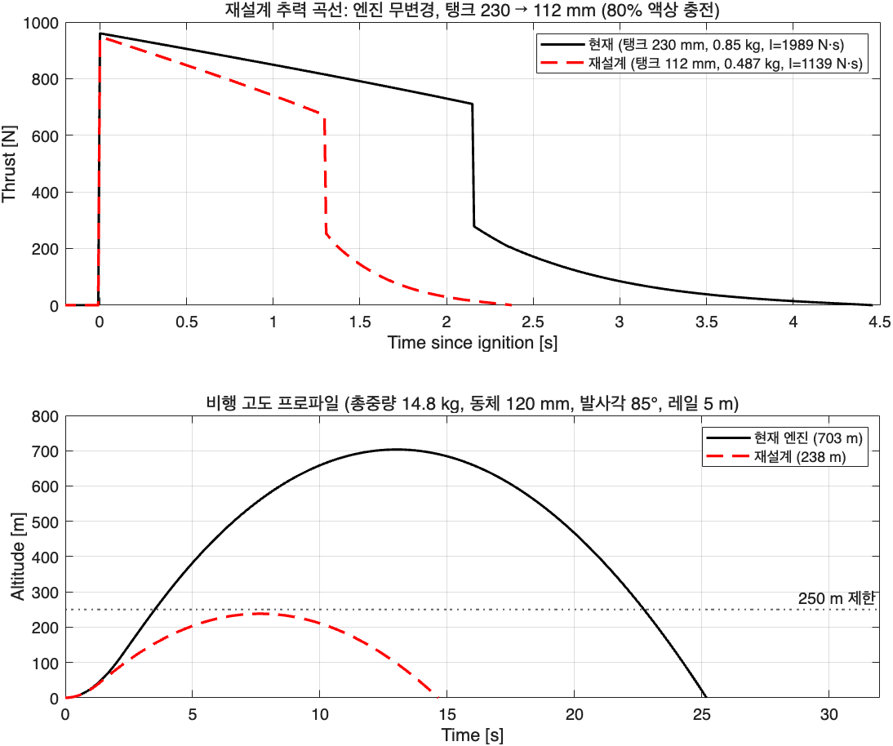

# 재설계 결과 (2026-07-04, 개정판)

[재설계 구상.md](재설계%20구상.md) 개정 제원(총중량 14.8 kg, 동체 ⌀120 mm, 발사각 85°, 레일 5 m) 기준. 2026 분무·연소시험 교정 모델(fmult=4, Cd=0.60, fuel a=0.055, η_c*=0.95, flex 6.35 mm) 사용.

**운용 제약**: 부분 충전 불가 — 탱크 내부 높이의 **최소 80%가 액상**으로 채워져야 함. 따라서 탱크 높이 h와 산화제 질량 m은 독립이 아니라 m(h) = A_tank·h·(0.8·ρ_l + 0.2·ρ_v) @ 15 °C ≈ **4.34·h[m] kg**으로 연동됨.

## 최종 설계: 엔진 무변경 + 탱크 단축 230 → 112 mm

```
u.tank.h = 230 → 112 mm
u.tank.m = 0.85 → 0.487 kg   (80% 액상 충전 규칙에 따른 연동값)
```

인젝터(⌀1.4 × 28), 노즐(Dt 17 / De 35), 그레인(R7.5 × 7, L230) **모두 그대로**. 설정: `Config/2026_nova_redesign.mat` → `Run_Config` + `Flight_From_Config('2026_nova_redesign')`로 재현.

| 항목 | 목표 | 현재 엔진 | **최종 재설계** |
| --- | --- | --- | --- |
| 최대 고도 | ≤ 250 m (목표 근접 ~240) | 703 m | **238 m** |
| 레일 탈출속도 | ≥ 15 m/s | 23.7 m/s | **22.7 m/s** |
| 총임펄스 | — | 1989 N·s | 1139 N·s |
| 준정상 추력 / Pc | — | 819 N / 25.5 bar | 794 N / 25.1 bar |
| 액상 연소시간 | — | 2.15 s | 1.30 s |



## 탱크 높이 스윕 (80% 액상 충전 규칙, 개정 제원)

| h [mm] | m [kg] | I [N·s] | 고도 [m] | 레일 [m/s] |
| --- | --- | --- | --- | --- |
| 110 | 0.478 | 1117 | 229 | 22.6 |
| **112** | **0.487** | **1139** | **238** | **22.7** |
| 113 | 0.491 | 1149 | 242 | 22.7 |
| 115 | 0.500 | 1170 | 251 | 22.7 |
| 120 | 0.522 | 1223 | 274 | 22.8 |
| 130 | 0.565 | 1325 | 322 | 23.0 |
| 140 | 0.609 | 1431 | 374 | 23.1 |

민감도: **탱크 1 mm ≈ 산화제 4.3 g ≈ 고도 약 4.4 m**. h ≥ 115 mm부터 250 m 초과.

## 시스템 특성 (설계 자유도의 실상)

교정 모델에서 공급계는 **급기 라인 지배** — 인젝터는 비초크(압력비 0.90~0.92), 라인(플렉시블 6.35 mm + 밸브)이 8~11 bar를 소모하며 유량을 결정:

1. 인젝터 홀 28 → 19개(-32%)로 줄여도 유량 −9%뿐 → **우선순위 1(인젝터)은 유량 제어력 없음**
2. 라인 지배에서 F = C_f·η·c*·ṁ (노즐목과 1차 독립) → **우선순위 2(노즐)는 Pc만 바꾸고 추력·유량 불변**
3. 레일 탈출속도(~23 m/s)는 이 하드웨어 조합의 고정값 (요건 15 m/s는 여유 만족). 낮추려면 라인 쪽 변경 필요
4. 유일한 실효 레버 = 산화제 탑재량(임펄스) → 80% 충전 규칙 하에서는 **탱크 높이가 곧 고도 조절 다이얼**

## 검증 및 주의사항

- **모델 바이어스 (중요)**: 교정 모델은 2026 연소시험 대비 총임펄스 −5% (추력 −0.6%, 액상시간 −2%). 이 바이어스가 실기에서 그대로면 고도는 시뮬 대비 **약 +10% (238 → ~260 m)**가 될 수 있음. 250 m가 규정상 엄격한 상한이라면 **h = 108~110 mm (시뮬 220~229 m, 실기 추정 240~250 m)**를 권장. h=112는 "시뮬 기준 240 m" 요청값.
- 액상 구간 노즐 출구압 Pe ≥ 0.77 bar — 박리 여유 있음 (Summerfield ~0.4 bar).
- O/F 5.2~6.1 (기존 4.4~5.5 대비 상승), 연료 소모 0.096 kg — 그레인 웹 여유 충분.
- 초기 기상 분율 X₀ = 0.06 (80% 충전) — 증기 꼬리 임펄스 비중 ~10%로 작음 (부분충전안 26% 대비 예측 신뢰도 유리).
- 충전 온도 민감도: m(h) 연동값은 15 °C 기준. 충전 온도가 다르면 ρ_l 변화로 80% 규칙의 질량이 달라짐 (예: 10 °C ≈ +2%, 20 °C ≈ −3%) — 충전 절차서에 온도 보정표 반영 권장.
- 재설계 탐색 중 Pc 수렴 루프 결함(비초크 영역 Pinj 무감쇠 발산)을 발견·수정함(`System/LiqFeed.m`, `VapFeed.m`). 기존 검증 케이스 결과 불변 확인.

## 이력

- 1차안 (14.5 kg/80°/⌀110, 부분충전 허용 가정): 하드웨어 무변경 + 0.45 kg 부분충전 → 176 m. **운용 제약(80% 충전 규칙)으로 폐기.**
- 개정안 (14.8 kg/85°/⌀120, 80% 충전 규칙): 탱크 112 mm / 0.487 kg → 238 m. **채택.**
